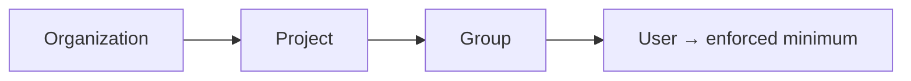

# Budgets & limits

Budgets and limits are how you control AI spend. The gateway enforces **hierarchical monthly USD budgets** and
**per-minute token limits**, so no team can run up a surprise bill.

::: info Who can do this
**Org admins** (for their organization) and **platform admins**, on **Projects → Budgets & Limits**.
:::

## The hierarchy

Budgets cascade: **organization ≥ project ≥ group ≥ user**, and the **tightest cap always wins**. A platform
owner sets a hard ceiling at the top and delegates finer caps downward.

## Set a budget

1. Open **Projects → Budgets & Limits**.
2. Set a **project**, **group**, or **user** monthly USD budget.
3. Optionally set a **per-minute token limit (TPM)** at the same level.
4. Save. The control plane reconciles the limits to the gateway within seconds.

## Remove a budget

Every row in the limits table has a **Delete** — the project ceiling, a group default, or an
individual override. Deleting a limit doesn't leave a consumer unbounded: enforcement simply
**falls back to the next level up** (a user override → the group default → the project ceiling →
the organization). Use this to undo a one-off override once it's no longer needed.

## What happens at the cap

When a consumer reaches the tightest applicable budget or token limit, further requests are rejected with
`429 Too Many Requests` until the monthly reset (calendar month, UTC) or until you raise the cap. Semantic
caching reduces spend against budgets by serving similar prompts from cache.

## See where spend goes

The **Usage** screen (Organization section) breaks down token and cached-token usage by project and consumer,
so you can find the heavy users before they hit a cap.

## Next steps

- [Pricing](/admin/pricing) — the per-model rates budgets are calculated from.
- [Semantic cache](/admin/semantic-cache) — cut spend with caching.
