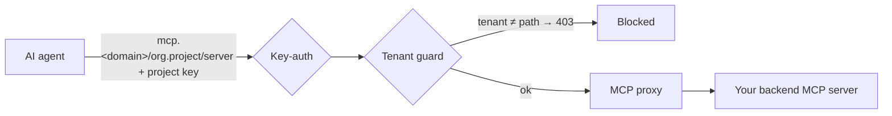

# MCP servers

The MCP gateway lets you give AI agents **governed access to tools**. You register remote Model Context Protocol
(MCP) servers per project; the gateway then fronts them with the same identity, isolation, and audit you use for
LLM traffic.

::: info Who can do this
**Org admins** (for their organization) and **platform admins**, on **Projects → MCP Servers**.
:::

## How a governed MCP request flows

A request must carry a valid **project API key** (key-auth) and may only reach **its own project's** path
(tenant guard) — a key from another project gets `403`.

## Register a server

1. Open **Projects → MCP Servers** and click **Add server**.
2. Enter a **name**, the backend **MCP server URL**, a **timeout**, and (if the backend needs one) an upstream
   **credential**.
3. Toggle **enabled** and save. The control plane provisions the route and isolation rules.
4. Share the generated **connect URL** with your developers:
   `https://mcp.<your-domain>/<organization>.<project>/<server-name>`.

> 📸 **Screenshot:** the MCP Servers tab (server list, add form, connect URL) — _placeholder; real capture pending._

## What's governed (Stage 1)

- **Access** — agents authenticate with the project API key (one key for chat and tools).
- **Isolation** — strict per-project: a key cannot reach another project's servers.
- **Activity** — tool-call activity is recorded per organization.

::: info Scope
This first stage covers **governed access + a catalog** of remote MCP servers. Per-tool budgets/guardrails and
auto-generating MCP servers from REST APIs are future capabilities.
:::

## Next steps

Developers connect to these servers via [Use MCP servers](/user/use-mcp-servers).
