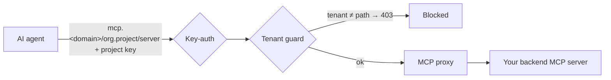

# MCP servers

The MCP gateway lets you give AI agents **governed access to tools**. You register remote Model Context Protocol
(MCP) servers per project; the gateway then fronts them with the same identity, isolation, and audit you use for
LLM traffic.

::: info Who can do this
**Org admins** (for their organization) and **platform admins**, on **Projects → MCP Servers**.
:::

## How a governed MCP request flows

A request must carry a valid **project API key** (key-auth) and may only reach **its own project's** path
(tenant guard) — a key from another project gets `403`.

## Register a server

On **Projects → MCP Servers → Add server**, pick a **Source**:

### Remote MCP server (proxy)
Front a backend that already speaks MCP.

1. Enter a **name**, the backend **MCP server URL**, the **transport** the backend speaks —
   **Streamable HTTP** (the default) or **SSE** — a **timeout**, and (if the backend needs one) an
   upstream **credential**.
2. Toggle **enabled** and save. The control plane provisions the route and isolation rules.
3. Share the generated **connect URL** with your developers:
   `https://mcp.<your-domain>/<organization>.<project>/<server-name>`.

### REST API (OpenAPI) — turn an existing API into a governed MCP server
Give agents your existing REST API as tools, with no code — each OpenAPI operation becomes an MCP tool.

1. Choose **Source → REST API (OpenAPI)** and enter a **name**.
2. **Paste the API's OpenAPI/Swagger spec** (JSON or YAML) and click **Discover tools**.
3. **Pick which operations** agents may call — the checklist *is* the access policy; unticked
   operations are not exposed at all.
4. Set the upstream **auth** the API needs (Bearer / API-key header + credential) if any, then save.
   The base URL is taken from the spec's `servers`. Share the same **connect URL** as above.

## What's governed

- **Access** — agents authenticate with the project API key (one key for chat and tools).
- **Isolation** — strict per-project: a key cannot reach another project's servers.
- **Proxying** — tool calls are proxied through the gateway to your backend server (or your REST API,
  for an OpenAPI source): a `tools/list` or `tools/call` reaches the upstream and returns its real
  result, governed end-to-end.
- **Tool selection** — for an OpenAPI source, only the operations you ticked are exposed as tools.
- **Activity** — tool-call activity is recorded per organization.

::: info Scope
This covers **governed access, proxying, a catalog, OpenAPI→MCP auto-generation, and per-operation
tool selection**. Per-tool budgets/guardrails are a future capability.
:::

## Next steps

Developers connect to these servers via [Use MCP servers](/user/use-mcp-servers).
