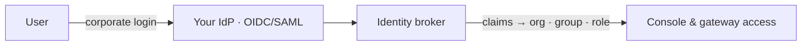

# SSO & IdP brokering

Each organization connects **its own** identity provider. Your users sign in with their corporate account and
land in the right organization, group, and role automatically — no per-user setup.

::: info Who can do this
**Org admins** configure their organization's identity provider on **Organization → SSO**. Platform admins
configure global login methods.
:::

## How brokering works

The broker reads the claims your identity provider sends (email, name, groups) and maps them to the right
**organization**, **group**, and **role**. On first login, a matching user is **provisioned just-in-time** — no
manual account creation.

## Connect your identity provider

1. Open **Organization → SSO**.
2. Add a connection — **OIDC** or **SAML** — with the endpoint/metadata from your IdP.
3. Configure **claim mappings**: which claim carries the email, the name, and the groups.
4. Map **groups to roles** (e.g. your `ai-admins` group → `org_admin`).
5. Optionally restrict to verified **email domains**.
6. Save and test. Your users can now sign in with their corporate account.

> 📸 **Screenshot:** the Organization SSO configuration (connection + claim mappings) — _placeholder; real capture pending._

::: tip One mechanism for all login
All brokered login flows through this per-organization path, so you manage identity in one place and users get a
consistent corporate sign-in.
:::

## Next steps

- [Organizations & members](/admin/organizations-and-members) — roles and groups the mappings target.
- [Hardening](/security/hardening) — identity and token security.
