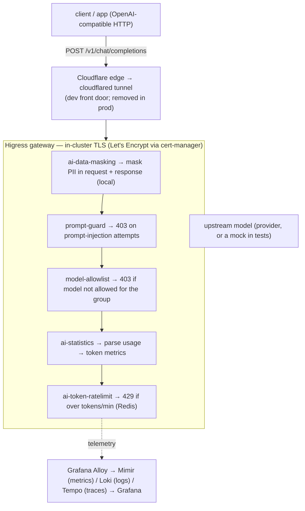
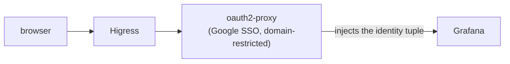

# Architecture

Opsta AI Gateway is **Higress as the data plane** with a thin, declarative
control surface around it. Every request flows through one gateway and a chain
of plugins; everything is rendered from code.

## Request flow

Human access (dashboards / console):

## Components

- **Higress** — the gateway (Envoy data plane + controller). Handles routing,
  TLS termination, and runs the AI plugins.
- **cert-manager** — issues Let's Encrypt certificates (ACME DNS-01 via
  Cloudflare) so **TLS is terminated in-cluster**, not at the edge. The same
  certificate serves dev (behind a Cloudflare Tunnel) and production (direct) —
  no manifest change between them.
- **Built-in AI plugins** — `ai-statistics` (token accounting),
  `ai-token-ratelimit` (Redis-backed token limits), and `ai-data-masking`
  (local PII masking), mirrored into your own registry (no runtime pull from a
  public cloud registry).
- **Custom plugins** — small Wasm guards written only where no built-in fits:
  the per-group **model-allowlist** and the **prompt-guard** injection blocker.
- **Redis** — backing store for rate-limit counters (managed by the Opstree
  Redis operator; standalone or HA).
- **Observability (LGTM)** — Grafana + Loki + Mimir + Tempo with **Grafana
  Alloy** collecting metrics and logs from the gateway.
- **oauth2-proxy** — brokers Google Workspace SSO in front of Grafana,
  enforces the company domain, and injects the identity tuple downstream. Runs
  in-cluster; no proprietary component.

## Identity

Every limit, budget, metric and key is keyed by the full identity tuple
**`{org, project, group, user}`**. The group/user arrive as request headers
(`x-dev-group` / `x-dev-user`); with SSO enabled, Google Workspace populates the
exact same headers — only the *source* of identity changes, nothing downstream.

## Multi-tenancy direction

The gateway is heading toward a multi-tenant product: a control plane stores a
per-**Project** spec and reconciles it into Higress config, with per-tenant
budgets, guardrails, API keys and dashboards. The single-tenant setup today is
built to be forward-compatible with that — adding a tenant means adding scoped
config, never rewriting the core.
