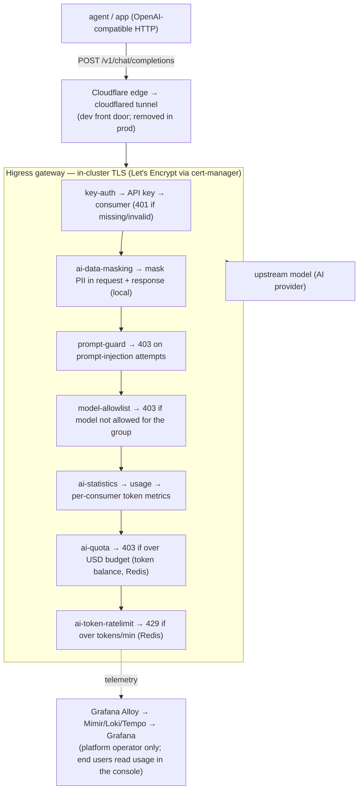
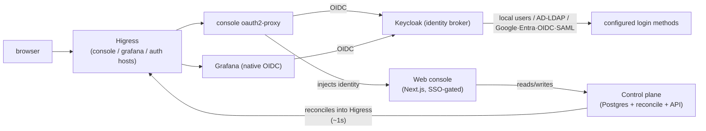

# How it works

Opsta AI Gateway is **Higress as the data plane** with a control plane
(Postgres + reconcile loop + API) and a web console on top. Every request flows
through one gateway and a chain of plugins; all configuration is declarative.

## Request flow

## Human access

## Key components

- **Higress** — the gateway (Envoy + controller). Routes requests, terminates
  TLS, and runs the plugin chain.
- **Built-in plugins** — key-auth (API key → consumer), ai-statistics (token
  accounting), ai-token-ratelimit (token rate limits), ai-quota (USD budget
  enforcement), and ai-data-masking (PII masking). All mirrored into your own
  registry — no runtime pull from a public cloud registry.
- **Custom plugins** — model-allowlist (per-group model enforcement) and
  prompt-guard (injection blocking), written as small Wasm modules (Go).
- **Control plane** — Postgres database is the source of truth for tenant data
  (orgs, projects, members, API keys, budgets, prices, guardrail patterns,
  provider config). A reconcile loop projects it onto the live gateway
  WasmPlugins within ~1 second of any change. A write API serves the console.
- **Web console** — a Next.js app, SSO-gated, where users see their usage and
  budgets, issue API keys, and connect their tools. Admins manage orgs, members,
  projects, providers, pricing, identity providers, and the audit log.
- **Budget controller** — a periodic job that reads each consumer's month-to-date
  token usage from the durable ledger, prices it, and enforces USD budgets.
- **Usage ledger** — the control plane samples per-consumer token counters and
  accumulates durable month-to-date totals in Postgres. The console and budgets
  read this ledger, so usage stays accurate across gateway restarts and month
  boundaries.
- **Redis** — backing store for rate-limit counters.
- **Keycloak** — identity broker (Apache-2.0) that fronts local users,
  AD/LDAP, Google, Microsoft Entra, any OIDC or SAML provider — all coexist,
  all with per-scheme group mapping. Console and Grafana authenticate through it.
- **Grafana LGTM** — Loki (logs), Mimir (metrics), Tempo (traces), Alloy
  (collector). Grafana is a platform-operator tool only; end users read their
  usage in the console.

## Identity

Every limit, budget, metric and key is keyed by the full identity tuple
**`{org, project, group, user}`**. Whether identity arrives from local
Keycloak accounts, a corporate IdP, or Google — the shape is the same and
downstream enforcement never needs to change.

**Console → control-plane security.** The console forwards the signed
Keycloak JWT it already holds (via oauth2-proxy) to every control-plane API
call. The control plane verifies the JWT signature against the realm JWKS
before trusting any identity claim — no forwarded-header trust. Alongside the
JWT, an internal shared secret (`X-Internal-Auth`) gates all control-plane
endpoints, ensuring only in-cluster callers can reach the API.

## Multi-tenancy

The gateway is a multi-tenant product. Organisations are isolated end to end:

- Cross-org admin and config writes are refused by the control plane.
- Each org is its own observability tenant — one org can never read another's
  telemetry.
- Members see only their own org's usage in the console.
- Adding a tenant means adding scoped config, never rewriting the core.

## Deployment

The whole product ships as **one Helm chart**. A single configuration surface
(`values.yaml`) holds deploy-anywhere defaults; environment-specific overrides
go in a small overlay file. Secrets live in a separate git-ignored file. The
same chart deploys to a local development cluster or production with a few
value changes — there are no hand-applied manifests and no per-environment
scripts.
