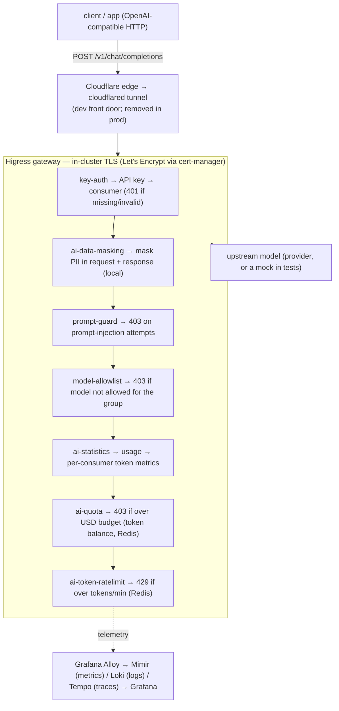
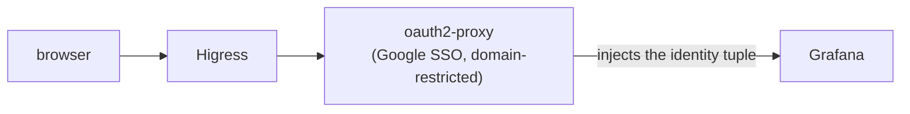
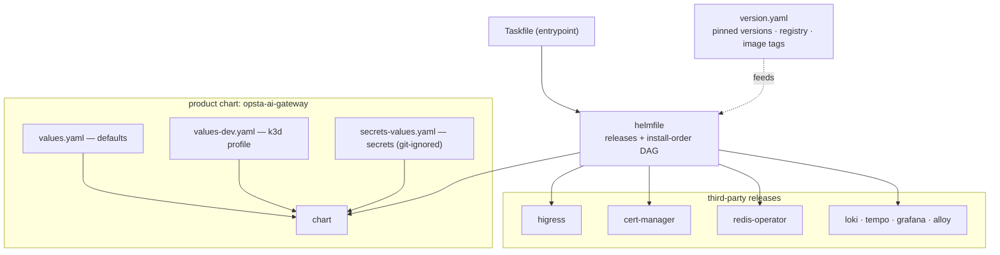
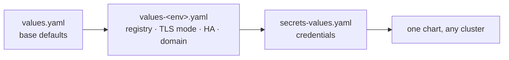

# Architecture

Opsta AI Gateway is **Higress as the data plane** with a thin, declarative
control surface around it. Every request flows through one gateway and a chain
of plugins; everything is rendered from code.

## Request flow

Human access (dashboards / console):

## Components

- **Higress** — the gateway (Envoy data plane + controller). Handles routing,
  TLS termination, and runs the AI plugins.
- **cert-manager** — issues Let's Encrypt certificates (ACME DNS-01 via
  Cloudflare) so **TLS is terminated in-cluster**, not at the edge. The same
  certificate serves dev (behind a Cloudflare Tunnel) and production (direct) —
  no manifest change between them.
- **Built-in AI plugins** — `key-auth` (API-key → consumer), `ai-statistics`
  (token accounting), `ai-token-ratelimit` (Redis token limits), `ai-quota`
  (Redis per-consumer USD-budget balance), and `ai-data-masking` (local PII
  masking), mirrored into your own registry (no runtime pull from a public cloud
  registry).
- **Custom plugins** — small Wasm guards written only where no built-in fits:
  the per-group **model-allowlist** and the **prompt-guard** injection blocker.
- **budget-controller** — a small in-cluster CronJob: reads per-consumer token
  usage, prices it with a per-model USD table, and enforces each consumer's
  dollar budget via ai-quota. The dollar "brain"; the gateway is the cutoff.
- **Redis** — backing store for rate-limit counters (managed by the Opstree
  Redis operator; standalone or HA).
- **Observability (LGTM)** — Grafana + Loki + Mimir + Tempo with **Grafana
  Alloy** collecting metrics and logs from the gateway. **Each organization is its
  own tenant** (`X-Scope-OrgID`): Alloy fans out a per-org metrics stream, and a
  credential-aware proxy in front of the stores pins every credential to its tenant
  so reads can't cross organizations. Grafana is a platform-operator tool (login
  limited to platform admins); end users read their own org's usage in the console.
- **oauth2-proxy** — brokers Google Workspace SSO in front of Grafana and the
  console, enforces the company domain, and injects the identity tuple
  downstream. Runs in-cluster; no proprietary component.
- **Web console** — a Next.js app on `console.<baseDomain>`, SSO-gated, where a
  user logs in with their organization email to see their API key, token/USD
  usage and remaining budget, and allowed models; admins get a read-only view of
  every consumer. Reads live usage from Mimir and config from the same values the
  gateway uses.

## Identity

Every limit, budget, metric and key is keyed by the full identity tuple
**`{org, project, group, user}`**. The group/user arrive as request headers
(`x-dev-group` / `x-dev-user`); with SSO enabled, Google Workspace populates the
exact same headers — only the *source* of identity changes, nothing downstream.

## Deployment & configuration

The whole product ships as **one Helm chart** (`opsta-ai-gateway`). A `helmfile`
installs it next to the third-party releases it depends on (Higress,
cert-manager, the Redis operator, and the LGTM stack), and pins every version in
one place. You configure everything through values files — there are no
hand-applied manifests and no per-environment scripts.

**One config surface, layered.** `values.yaml` holds deploy-anywhere defaults;
an environment overrides only what differs (registry, TLS mode, HA on/off,
domain); secrets live in a separate git-ignored file. To deploy elsewhere you
write a small overlay, not a fork.

Key toggles in `values.yaml`: `global.highAvailability` (standalone ↔ HA),
`global.registry` / `imagePullSecrets` (any OCI registry), `global.baseDomain`
+ `subdomains`, `tls.mode` (`letsencrypt` | `provided` | `selfsigned`),
`ingress.tunnel.enabled` (optional Cloudflare Tunnel), and
`global.namespacePrefix`.

**Reuse existing operators (BYO).** Clusters often already run cert-manager (and
sometimes the Redis or CloudNativePG operators); installing a second copy
collides on CRDs and webhooks. Set `certManager.enabled`, `redisOperator.enabled`,
or `cnpg.enabled` to `false` to **reuse** an operator already present — the chart
then deploys only the resources that operator manages (certificates, Redis, the
Postgres cluster) against the existing controller. Defaults are `true` (turnkey
install). Reuse assumes a compatible operator version.

**Subdomain scheme (`global.subdomainSeparator`).** Hosts are composed as
`<service><sep><baseDomain>`:

- `"."` → `api.ai-gateway.opsta.dev` — a clean second-level wildcard
  (`*.ai-gateway.opsta.dev`). Behind Cloudflare this needs an edge cert that
  covers that depth (Advanced Certificate Manager / Total TLS), since free
  Universal SSL only covers `example.com` + `*.example.com`.
- `"-"` → `api-ai-gateway.opsta.dev` — a single-level name under the registrable
  domain, covered by free Cloudflare Universal SSL `*.opsta.dev`. No extra cert
  product. (When fronting via a Cloudflare Tunnel, set the origin to
  `https://…:443` with **No TLS Verify** on, since the in-cluster cert won't match
  the dash host.)

## Multi-tenancy

The gateway is a multi-tenant product: a control plane (Postgres source of truth)
reconciles per-**Organization** and per-**Project** config into Higress —
providers, model routing, guardrails, API keys, budgets — and into the
observability layer. Organizations are isolated end to end: cross-org admin and
config writes are refused, and **each org is its own observability tenant** so one
organization can never read another's telemetry. Adding a tenant means adding scoped
config, never rewriting the core.
