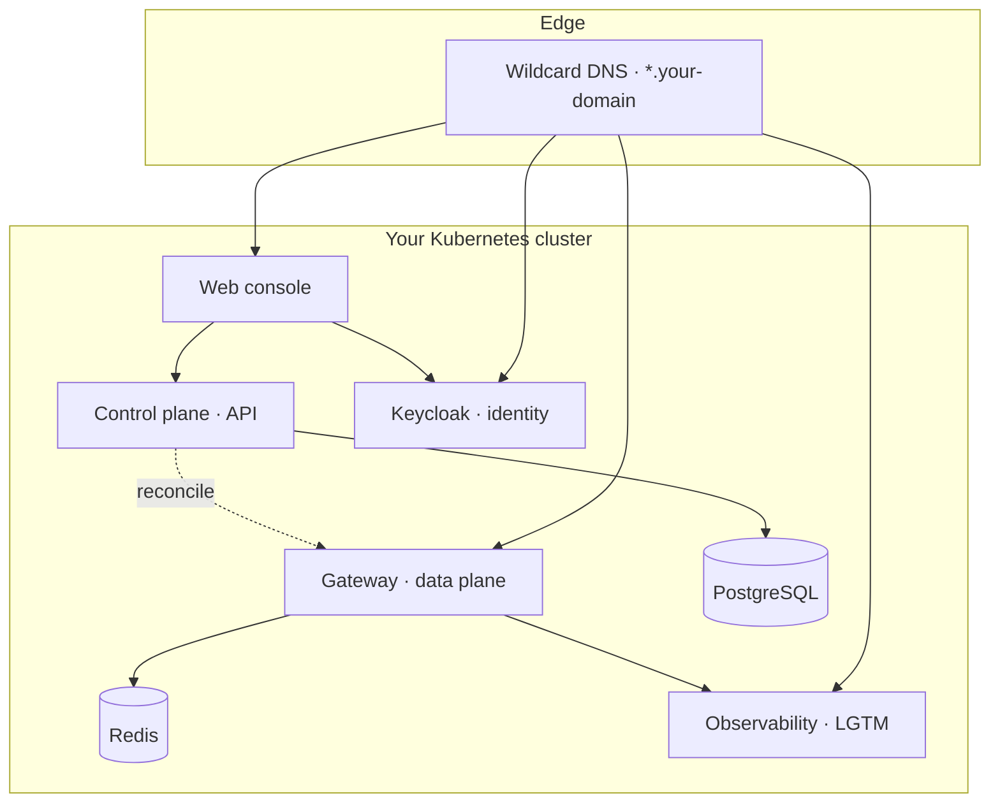

# Install

The whole platform is **one Helm chart** with **one values file**. You set a base domain, choose a TLS mode,
pick a few high-level toggles, and install. The chart brings up the gateway, control plane, database, identity,
observability, and console together.

::: info Prerequisite
Make sure your cluster meets the [Requirements](/operate/requirements) first — Kubernetes ≥ 1.28, a default
StorageClass, a base domain, and a way to issue a wildcard certificate.
:::

## Install modes

The platform supports **two install modes** — both deploy the *same* Helm chart; they differ only in *how*
releases are applied and reconciled, not in what runs:

- **Helmfile (default, recommended).** The tested production path documented on this page: one chart, one
  values file, `helmfile sync`. This is what [Requirements](/operate/requirements),
  [Production deployment (HA)](/operate/deploy/ha), and the deployment runbook target.
- **ArgoCD GitOps (alternative).** A continuously-reconciled, drift-correcting, audited deploy via an ArgoCD
  **app-of-apps**, with secrets sourced from **Vault → External Secrets Operator** (kept out of git
  entirely). It is currently **validated for dev / single-node (k3d)**; production-grade GitOps — HA Vault,
  a customer Git repo + TLS, CI-driven promotion, and multi-cluster topologies — is on the roadmap.

::: tip Which to use
For production installs today, use **helmfile** (the rest of this page). GitOps is a good fit when you want
drift detection and an audit trail and are comfortable on the dev-validated path; track the roadmap for the
production-hardened GitOps mode.
:::

## Deployment topology



## 1. Add the chart repository

The chart is published as an OCI artifact. Authenticate to the registry if required, then you can install
directly from the OCI reference.

```bash
helm registry login ghcr.io   # if your registry requires auth
```

## 2. Write your values file

Create a `values.yaml` that captures the decisions for this environment. The minimum is your domain, a TLS mode,
identity, and a bootstrap admin:

```yaml
global:
  baseDomain: ai-gateway.example.com
  subdomainSeparator: "."        # "." for two-level names, "-" for single-level under a parent wildcard
  highAvailability: false        # true for production multi-replica

tls:
  mode: letsencrypt              # letsencrypt | provided | selfsigned
  letsencrypt:
    email: platform@example.com
    dns01:
      provider: cloudflare
      dnsZone: example.com

sso:
  mode: google                   # google | mock (mock is dev/test only)
  emailDomain: example.com

controlPlane:
  enabled: true
  bootstrapAdmin:
    enabled: true
    email: admin@example.com     # the first person who can sign in and configure everything
postgres:
  enabled: true                  # control plane needs its database
```

Secrets (provider keys, OIDC client secret, database passwords) live in a **separate, git-ignored** values file
or in pre-existing Kubernetes Secrets — never in the file you commit. See
[Configuration](/operate/configuration#secrets) and [Hardening](/security/hardening).

::: warning Keep secrets out of git
Set `secrets.createFromValues: true` and supply a local secrets file, **or** set it to `false` and reference
existing Secrets managed by Vault/sealed-secrets. Do not put credentials in your main `values.yaml`.
:::

## 3. Install

```bash
helm install opsta-ai-gateway oci://ghcr.io/opsta/charts/opsta-ai-gateway \
  --namespace opsta-ai-gateway --create-namespace \
  -f values.yaml -f secrets-values.yaml
```

The chart installs the required operators (cert-manager, CloudNativePG, Redis operator) unless you tell it to
[reuse existing ones](/operate/byo-operators).

## 4. Wait for readiness

The control plane runs database migrations and a first reconcile before it reports ready — this guarantees the
gateway is never half-configured.

```bash
kubectl -n opsta-ai-gateway rollout status deploy/control-plane
kubectl -n opsta-ai-gateway get pods
```

```bash
$ kubectl -n opsta-ai-gateway get pods
NAME                                    READY   STATUS    RESTARTS   AGE
console-7c9b8c476f-9q4md                1/1     Running   0          12m
console-oauth2-proxy-6b746965fd-2xk8p   1/1     Running   0          12m
control-plane-5d5bf75cc8-hg82g          1/1     Running   0          12m
gateway-higress-7d8c9b6f54-p7w2n        1/1     Running   0          14m
keycloak-0                              1/1     Running   0          13m
opsta-pg-1                              1/1     Running   0          13m
redis-0                                 1/1     Running   0          13m
```

## 5. Point DNS and sign in

Create a wildcard DNS record for `*.your-domain` pointing at the gateway's ingress (or configure the Cloudflare
Tunnel). Then open `https://console.your-domain` and sign in as the bootstrap admin.

## Next steps

- [Configuration](/operate/configuration) — the full config surface, grouped by concern.
- [TLS & domains](/operate/tls-and-domains) — certificates and subdomains in detail.
- [High availability](/operate/high-availability) — turn on multi-replica production mode.
