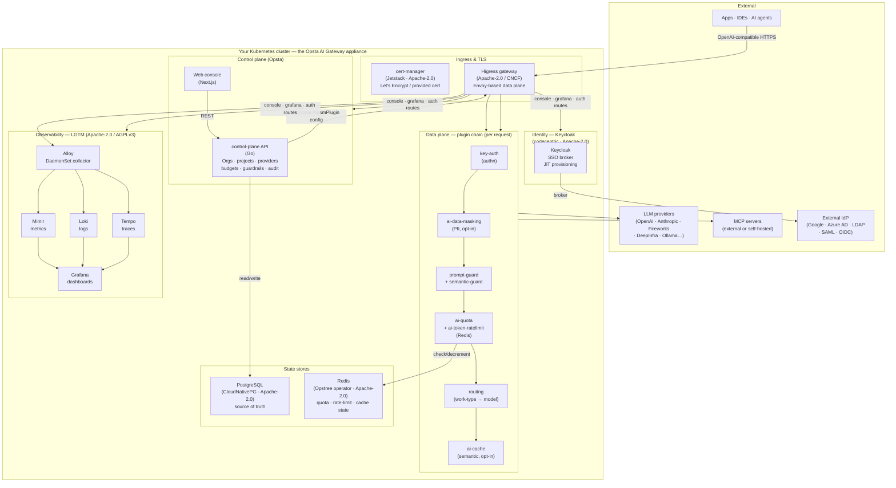
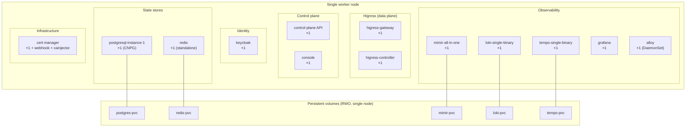
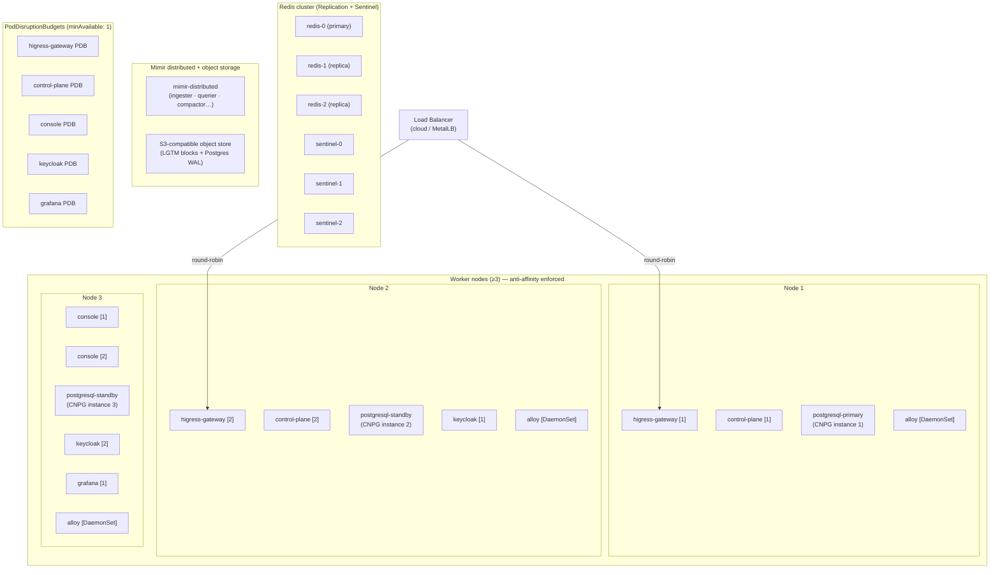
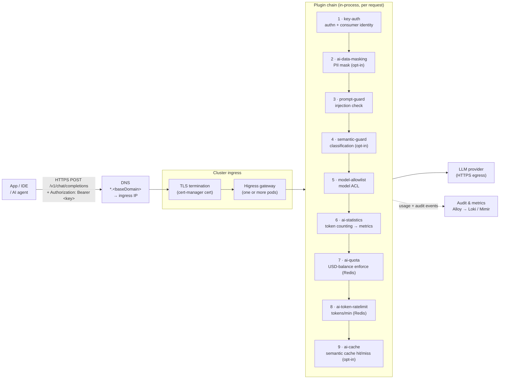
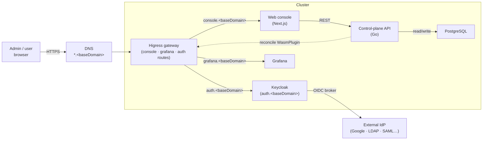
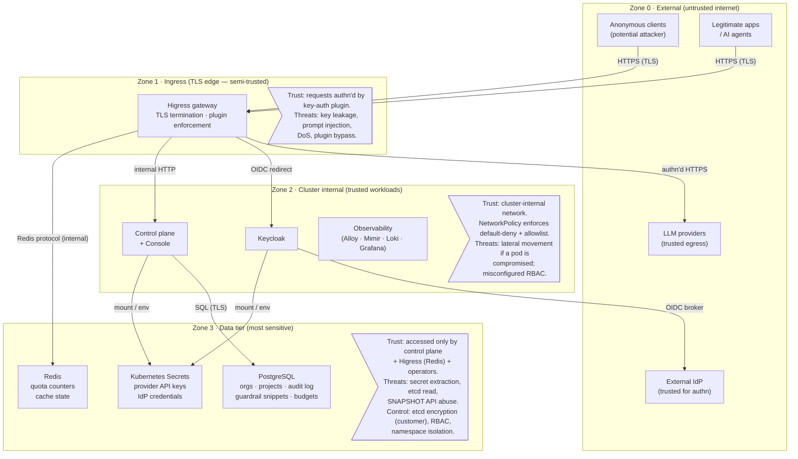

# Reference Architecture

This is the authoritative document set for deploying, securing, operating, and signing off Opsta AI
Gateway at your site. It covers two topologies — **Standalone** (PoC / single-node) and **High
Availability** (production) — and honestly states what the product does and does not do today,
so your architecture-review board can gate on facts, not implied posture.

Read this alongside the [Shared responsibility & maturity](./shared-responsibility.md) matrix and
the [Production-readiness checklist](./production-readiness.md) — every gap noted here has a
counterpart in those documents.

---

## Choosing a topology

| | Standalone | High Availability |
|---|---|---|
| **Use case** | PoC · dev · internal evaluation | Production · customer-facing |
| **Node layout** | 1 all-in-one worker | ≥3 workers (+ 3 control-plane nodes for RKE2) |
| **Replicas** | 1 per component | 2–3 per stateless component; clustered stateful |
| **Database** | 1 PostgreSQL instance | 3-instance CNPG cluster (sync + auto-failover) |
| **Cache/quota store** | Redis standalone | Redis Replication + Sentinel (3 nodes) |
| **Metrics** | Mimir all-in-one (local PVC) | Mimir distributed + object storage |
| **Logs / Traces** | Loki + Tempo single-binary (local PVC) | Loki + Tempo scaled + object storage |
| **Backup** | Optional (off by default) | **Required** — object store + restore drill |
| **RTO target** | Hours (manual rebuild) | Minutes–hours (IaC rebuild + restore) |
| **RPO target** | Last backup (hours) | Last backup interval (configurable, target <1 h) |
| **Stated limits** | No HA; data loss on node failure; restore-only DR | Single-site; no cross-region failover; restore-based DR |
| **Helm toggle** | `global.highAvailability: false` | `global.highAvailability: true` |

::: warning Honest DR baseline
Both topologies are **single-site, restore-based DR**. The HA topology survives node loss within
the cluster (replicas + anti-affinity); it does not survive a full site loss without a restore
from backup onto fresh infrastructure. See [Backup & DR](./backup-and-dr.md) and the
[Reliability section](#reliability--ha--dr) below.
:::

---

## Logical architecture

All components ship as one tested unit — the full appliance. You bring a conformant Kubernetes
cluster, storage, and DNS. Optionally an external IdP and an S3-compatible object store.

**Component licences in one view:**

| Component | Licence | Provided by |
|---|---|---|
| Higress gateway + controller | Apache-2.0 | CNCF / Alibaba |
| Control plane + Console | Proprietary (Opsta) | Opsta |
| PostgreSQL via CloudNativePG | Apache-2.0 | CNCF |
| Redis via Opstree operator | Apache-2.0 | Opstree |
| Keycloak | Apache-2.0 | Red Hat / CNCF |
| cert-manager | Apache-2.0 | CNCF |
| Grafana | AGPLv3 | Grafana Labs |
| Mimir, Loki, Tempo, Alloy | Apache-2.0 | Grafana Labs |
| Qdrant (optional) | Apache-2.0 | Qdrant |
| Ollama (optional, self-hosted model) | MIT | Ollama |

---

## Standalone (PoC / single-node)

### Deployment topology

All workloads run on a single Kubernetes worker node. This topology has no redundancy — a node
failure causes a full outage. Use it for evaluation and internal tooling only.

### Stated limits (standalone)

- **No high availability.** Every component is a single pod; a crash or node reboot = outage.
- **Data at risk on node loss.** Persistent volumes are node-local by default; a node replacement
  risks data loss unless the StorageClass migrates PVCs.
- **Restore-only DR.** Recovery = rebuild cluster (IaC) + restore database from the last backup
  (if taken). Backups are off by default — you must enable them before relying on them.
- **Not for regulated data** unless you have accepted the gaps in the
  [Shared responsibility matrix](./shared-responsibility.md).

---

## High availability (production)

### Deployment topology

Workloads spread across ≥3 worker nodes. Stateless components run ≥2 replicas with pod
anti-affinity. Stateful components use their operators' built-in clustering.

### Per-component HA matrix

| Component | Standalone replicas | HA replicas | PDB (HA) | Operator / clustering |
|---|---|---|---|---|
| Higress gateway | 1 | ≥2 + anti-affinity | minAvailable 1 | Higress controller |
| Higress controller | 1 | 1 (leader-elect) | — | built-in |
| Control-plane API | 1 | 2 + anti-affinity | minAvailable 1 | — (stateless) |
| Console (Next.js) | 1 | 2 + anti-affinity | minAvailable 1 | — (stateless) |
| PostgreSQL | 1 instance | 3 instances (sync standby) | — (operator) | CloudNativePG |
| Redis | 1 standalone | 3 (Replication + Sentinel) | — (operator) | Opstree operator |
| Keycloak | 1 | ≥2 + anti-affinity | minAvailable 1 | codecentric chart |
| Mimir | all-in-one (1 pod) | distributed components | per-component | Grafana |
| Loki | single-binary (1 pod) | scaled + object storage | per-component | Grafana |
| Tempo | single-binary (1 pod) | scaled + object storage | per-component | Grafana |
| Grafana | 1 | ≥2 + anti-affinity | minAvailable 1 | — |
| Alloy | DaemonSet (1/node) | DaemonSet (1/node) | — (DaemonSet) | — |
| cert-manager | 1 | ≥2 | minAvailable 1 | — |

---

## Network & traffic flow

### Request path

### Browser / admin path

---

## Trust boundaries & threat model

The following diagram shows the trust zones and the key data flows that cross them. Detailed
STRIDE analysis, controls, and residual risk are in [Security overview](/security/overview) and
[Hardening](/security/hardening).

::: info Trust boundary controls today
- **Zone 0 → Zone 1:** TLS at ingress (cert-manager); key-auth plugin rejects unauthenticated requests.
- **Zone 1 → Zone 2:** Cluster-internal HTTP; NetworkPolicy allowlist restricts which pods may call which.
- **Zone 2 → Zone 3:** PostgreSQL access is credentials-gated (CNPG app secret); Redis is network-restricted by NetworkPolicy.
- **Zone 3 secret encryption:** Standard Kubernetes Secrets (base64 only) unless you add etcd encryption, sealed-secrets, or an external-secrets/KMS integration — see [G3 in the shared-responsibility matrix](./shared-responsibility.md).
:::

---

## Reliability / HA / DR

Per-component CPU/RAM/disk sizing is measured and documented in [Requirements](./requirements.md).
Load model: ~5 RPS sustained, 1 org/project, ~10 users (PoC/small-team baseline).

**Standalone headline (measured, v1.11.1):** ~0.1 vCPU / 3.8 GiB RAM idle; 28 Gi PVC total.
Recommended node: **4–8 vCPU / 8–16 GiB RAM / 50 Gi disk**.

**HA headline (estimated from standalone measurements):** ~340m CPU / 7 GiB RAM across ≥3 nodes.
Recommended per worker node: **4–8 vCPU / 8–16 GiB RAM / 50 Gi disk**.

See [Requirements → Compute](./requirements.md#compute) for the full per-component breakdown.

### FMEA — verified on running cluster (Standalone, v1.11.1)

The table below records failure modes exercised against the `k3d-higress-lab` dev cluster (k3s v1.36, product v1.11.1, Standalone topology). Each row states what was done, what was observed, and what the operational implication is.

| Failure mode | How triggered | Observed behavior | Recovery time | Operational implication |
|---|---|---|---|---|
| **Control-plane pod killed** | `kubectl delete pod -l app=control-plane` (force) | Data plane served **HTTP 200** throughout — zero dropped requests | ~28 s (Deployment re-schedules) | Request serving unaffected. Config changes (new provider, route, budget) are blocked until CP restarts. HA: 2 replicas + PDB prevents single-pod outage. |
| **PostgreSQL pod killed** | `kubectl delete pod opsta-pg-1` (force) | Data plane served **HTTP 200** throughout — zero dropped requests | ~36 s (CNPG operator restores pod) | Request serving unaffected; Envoy serves from cached plugin config. CP API calls that write to PG fail. HA: 3-instance sync cluster auto-promotes a standby. |
| **Keycloak pod killed** | `kubectl delete pod keycloak-keycloakx-0` (force) | AI API key requests served **HTTP 200**; new browser SSO sessions blocked | ~37 s (StatefulSet recreates pod) | `key-auth` plugin validates keys against data-plane cached config — no live Keycloak call. Console admin login and new OAuth sessions fail until KC restarts. HA: 2 replicas + PDB. |
| **Redis pod deleted (pod restart simulation)** | `kubectl delete pod redis-0` (force) | During restart: **HTTP 403** `ai-quota.noquota` — requests denied (**fail-closed**) | ~16 s (StatefulSet recreates pod) | `ai-quota` Wasm plugin cannot connect to Redis → logs `[critical]` → denies all quota-gated requests. **Intended behavior:** fail-closed prevents unbounded budget overrun when quota state is unknown. HA: Redis Replication + Sentinel keeps a primary available across single-node loss. |

**Not yet verified on this cluster:**
- Node loss in HA topology (requires multi-node HA cluster; Standalone has no node redundancy by design).
- cert-manager loss (existing TLS certs keep serving; renewal blocked until CM restarts).
- Redis primary failover time (Sentinel election) in HA topology.

::: warning Redis is in the critical path for quota enforcement
In Standalone, a Redis pod restart causes a brief denial window for all budget-gated requests until Redis recovers (~16 s observed). Monitor with `kube_pod_status_phase{pod=~"redis.*"}` and alert on pod restarts. In HA topology, Sentinel election eliminates this window.
:::

**DR objectives (honest baseline):**

| Metric | Standalone | HA |
|---|---|---|
| **RTO** | Hours (manual: rebuild IaC + restore DB) | Minutes–hours (IaC rebuild + restore; target <2 h) |
| **RPO** | Last backup age (backups off by default) | Backup interval (must be set; target <1 h) |
| **DR model** | Single-site, restore-based | Single-site, restore-based |
| **Node loss** | Full outage | Absorbed by replicas + anti-affinity |
| **Site loss** | Restore from backup | Restore from backup onto fresh infrastructure |

See [Backup & DR](./backup-and-dr.md) for the restore procedure.

---

## Security

Full security documentation is in the [Security](/security/overview) section. Key surfaces:

- [Security overview](/security/overview) — threat model summary, controls
- [Hardening](/security/hardening) — securityContext/PSS posture, NetworkPolicy, CIS-K8s alignment
- [Data sovereignty](/security/data-sovereignty) — data-in-flight to providers, no-train disclosure
- [RBAC model](/security/rbac) — how org/project/user roles map to API and gateway enforcement
- [Audit & compliance](/security/audit-and-compliance) — audit log, retention, compliance mapping

Full security documentation is published in the [Security](/security/overview) section — including
the encryption matrix, Kubernetes Secrets enumeration, pod securityContext/PSS posture,
egress allowlist, supply-chain status, and vuln/patch SLA.

---

## Data handling

The full data inventory — classification, retention, guardrail-snippet redaction, PII masking
guidance, provider data-flow, and cross-border/telemetry disclosure — is in
[Data handling](./data-handling.md).

**Quick reference — what's stored where:**

| Store | What lives there | Sensitivity | Retention control |
|---|---|---|---|
| PostgreSQL | Orgs, projects, users, key metadata, budgets, guardrail policy, **audit log**, **guardrail block snippets** | High | DB schema; snippet redaction configurable |
| Kubernetes Secrets | Provider API keys, IdP credentials, TLS certs, session keys | Critical | etcd encryption (customer-provided) |
| Redis | Quota counters, rate-limit state, semantic-cache entries | Low (ephemeral/reconstructible) | TTL-based; lost on cluster rebuild |
| Object store (HA) | Mimir metrics blocks, Loki log chunks, Tempo trace data, Postgres backup WAL | Medium | Per-component retention settings |

Prompts and completions transit the gateway to your configured LLM provider. **Nothing phones home
to Opsta.** Whether your provider uses your data for training is governed by your provider contract
— see [Data sovereignty](/security/data-sovereignty).

---

## Observability & SLOs

SLO definitions, error-budget policy, golden signals, and recommended Grafana alert rules are
documented in [Platform observability](./observability-platform.md).

The LGTM stack ships inside the appliance and is pre-wired:

- **Metrics** — Alloy scrapes all components; Mimir stores with per-org label isolation.
- **Logs** — Alloy tails container logs; Loki stores with per-org tenant isolation.
- **Traces** — Higress emits OTLP traces; Tempo stores them.
- **Dashboards** — Grafana ships with gateway, budget, quota, and per-org usage dashboards.
- **Alerting** — Grafana Alerting is pre-configured; wire it to your pager (PagerDuty/Opsgenie/
  webhook) — see the [Shared responsibility matrix](./shared-responsibility.md).

---

## Identity & access

See [SSO & IdP brokering](/admin/sso-and-idp) and [RBAC model](/security/rbac) for full detail.

**Summary:**

- **Broker:** Keycloak fronts all login methods — local users, Google Workspace, Azure AD/LDAP,
  OIDC, SAML. The platform-admin role is assigned by email (`console.adminEmails`).
- **JIT provisioning:** Users appear in the system on first brokered login (Just-In-Time). No
  automated de-provisioning on HR offboard — manual de-provision in Keycloak is required. SCIM is
  roadmap.
- **Break-glass:** A local `kcadmin` user (password in `secrets-values.yaml`, stored in your
  vault) provides console access when the IdP is unreachable.
- **API keys:** Issued per-user per-project from the console; stored as HMAC hashes in PostgreSQL
  (key material never in the database). Rotate by revoking and re-issuing.
- **Cert/secret rotation:** See the rotation procedure in [TLS & domains](./tls-and-domains.md)
  and the secrets enumeration in RA-SEC (coming).

---

## Platform & version matrix

The component matrix below is the set tested-compatible with the current product version. Bumping
any component version means re-testing the full set — see `version.yaml` and CLAUDE.md rule #9.

**Product version:** see `version.yaml:product.version` (current: **v1.11.1**)

| Component | Chart / operator | Current version | Licence |
|---|---|---|---|
| Kubernetes | — | ≥1.28 | — |
| Higress | `higress.io/higress` | 2.2.2 | Apache-2.0 |
| cert-manager | `jetstack/cert-manager` | v1.20.2 | Apache-2.0 |
| CloudNativePG | `cnpg/cloudnative-pg` | 0.28.2 | Apache-2.0 |
| Opstree Redis operator | `ot-helm/redis-operator` | 0.24.0 | Apache-2.0 |
| Keycloak | `codecentric/keycloakx` | see `version.yaml` | Apache-2.0 |
| Mimir (standalone) | `oci://ghcr.io/opsta/mimir-standalone` | 0.1.0 | Apache-2.0 |
| Mimir (distributed, HA) | `grafana/mimir-distributed` | 6.0.6 | Apache-2.0 |
| Loki | `grafana-community/loki` | 17.4.1 | Apache-2.0 |
| Tempo | `grafana-community/tempo` | 2.2.3 | Apache-2.0 |
| Grafana | `grafana-community/grafana` | 12.4.5 | AGPLv3 |
| Alloy | `grafana/alloy` | 1.8.2 | Apache-2.0 |

**Tested platforms:** k3s (dev/CI), RKE2 (reference), vanilla K8s, EKS, GKE, AKS.
**Architectures:** amd64. arm64 not yet validated.

---

## Installation & Day-2

See the [Install](./install.md) guide for the step-by-step `helmfile sync` flow.

::: info Deployment runbook — coming in M-runbook
A complete, copy-paste HA deployment runbook targeting **RKE2 on Linux VMs** (the reference
platform) is in progress as a companion milestone (M-runbook). It will live under
`/operate/deploy/ha-rke2.md` and cover provisioning, configuration, install, verification,
Day-1 config, and production hardening sign-off.
:::

**Upgrade path & rollback:** see [Upgrades](./upgrades.md). Note: control-plane schema
migrations are **forward-only at runtime** — always take a database backup before upgrading, and
confirm you can restore before proceeding (G7 in the
[shared-responsibility matrix](./shared-responsibility.md)).

**Air-gap:** see [Air-gapped install](./air-gap.md) for the registry-mirror and OCI chart flow.

---

## Shared responsibility & maturity

The full matrix — who owns what and at what maturity — is on the
[Shared responsibility & maturity](./shared-responsibility.md) page. That page is the
**honesty backbone**: no section above may claim a control that page does not list as **Shipped**.

---

## Production-readiness checklist

Before going live, walk every item in the
[Production-readiness checklist](./production-readiness.md). The checklist is the gating
artifact your team signs before the gateway handles production traffic.
