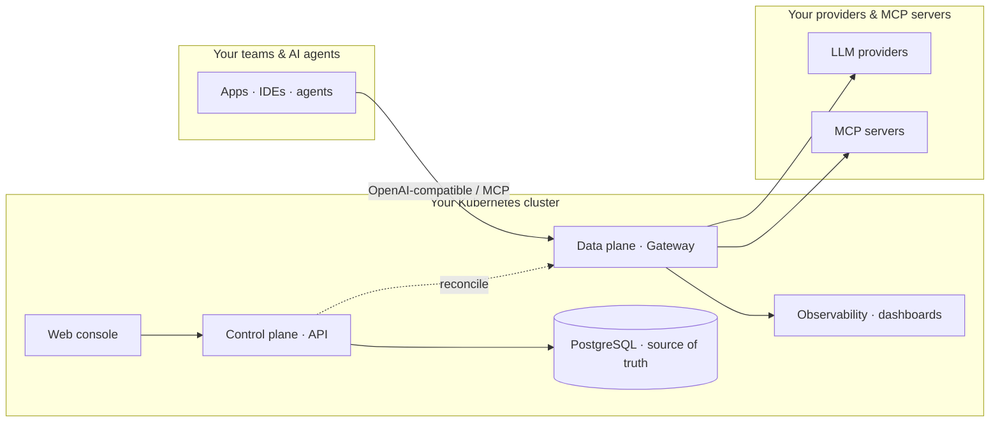

# Architecture

Opsta AI Gateway separates **management** from **traffic**. A control plane you own holds the configuration and
projects it onto a data plane you run. Both live in your Kubernetes cluster.

## The two planes

**Control plane.** A service backed by PostgreSQL that is the single source of truth for every organization,
project, provider, route, budget, guardrail, key, and MCP server. Administrators change configuration through
the [web console](/admin/console-tour) (or its API); the control plane validates it and writes it to the
database.

**Data plane.** The gateway that handles live traffic. It authenticates each request, enforces budgets and
limits, applies guardrails, routes to the right provider, serves cache hits, and records usage and audit
events. It never holds configuration of its own.

## Reconcile — no hand-edited config, no drift

The control plane continuously **reconciles** the desired state in PostgreSQL onto the data plane. When an
admin adds a provider or changes a budget, the reconcile loop applies it to the gateway automatically. This is
why deployments are consistent and auditable: there is no YAML to hand-edit and no configuration drift to
chase. See [How it works](/admin/console-tour) and [Reconcile in the request lifecycle](/overview/request-lifecycle).

## Supporting components

- **Web console** — the SSO-gated portal and admin UI (see the [User](/user/get-access) and
  [Administrator](/admin/console-tour) guides).
- **Identity** — single sign-on and per-organization identity-provider brokering
  ([SSO & IdP](/admin/sso-and-idp)).
- **Observability** — a self-hosted metrics, logs, and traces stack with per-organization isolation
  ([Observability](/admin/observability)).
- **State stores** — PostgreSQL (configuration, usage, audit) and Redis (rate-limit and quota state).

Everything runs inside your environment. Nothing about your prompts or data leaves the cluster. For how a
single request flows through these pieces, continue to the [Request lifecycle](/overview/request-lifecycle).
