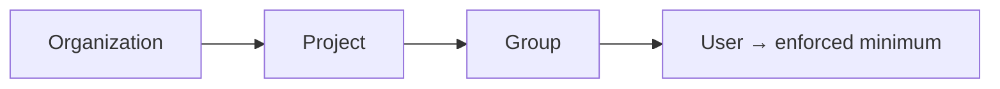

# งบประมาณและขีดจำกัด

**งบประมาณและขีดจำกัด** คือเครื่องมือควบคุมค่าใช้จ่ายในการใช้งาน AI โดย gateway จะบังคับใช้**งบประมาณ USD รายเดือนแบบลำดับขั้น** และ**การจำกัดจำนวน token ต่อนาที** เพื่อป้องกันไม่ให้มีทีมใดใช้งานจนมียอดใช้จ่ายส่วนเกินเกิดขึ้นโดยไม่ตั้งใจ

::: info ผู้ที่มีสิทธิ์ในการดำเนินการนี้
**Org admin** (สิทธิ์เฉพาะในองค์กรของตนเอง) และ **Platform admin** โดยดำเนินการผ่านหน้าจอ **Projects → Budgets & Limits**
:::

## โครงสร้างลำดับชั้น

งบประมาณจะส่งผลไล่ลงมาตามลำดับขั้น ได้แก่ องค์กร ≥ โปรเจกต์ ≥ กลุ่ม ≥ ผู้ใช้งาน ซึ่งระบบจะบังคับใช้**เพดานที่เข้มงวดที่สุดเสมอ** ช่วยให้ผู้ดูแลแพลตฟอร์มสามารถกำหนดเพดานสูงสุดเอาไว้ในระดับบนสุด และมอบหมายให้มีการกำหนดขีดจำกัดย่อยลงไปในระดับล่างได้

## วิธีการกำหนดงบประมาณ

1. เปิดหน้า **Projects → Budgets & Limits**
2. กำหนดค่าของงบประมาณ USD รายเดือนในระดับ **โปรเจกต์** **กลุ่ม** หรือ**ผู้ใช้งาน**
3. คุณสามารถเลือกกำหนดค่า**จำกัดจำนวน token ต่อนาที หรือ TPM** ในระดับเดียวกันเพิ่มเติมได้
4. คลิกบันทึก ซึ่ง control plane จะทำการปรับประสานข้อจำกัดดังกล่าวไปยัง gateway ภายในไม่กี่วินาที

## สิ่งที่เกิดขึ้นเมื่อใช้งานถึงเพดานที่กำหนด

เมื่อผู้บริโภครายใดรายหนึ่งใช้งานถึงงบประมาณหรือขีดจำกัดจำนวน token ที่เข้มงวดที่สุดที่มีผลบังคับใช้ คำร้องขอเพิ่มเติมหลังจากนั้นจะถูกปฏิเสธพร้อมสถานะกลับมาเป็น `429 Too Many Requests` จนกว่าจะถึงรอบการรีเซ็ตรายเดือน (รอบเดือนตามปฏิทินในเขตเวลา UTC) หรือจนกว่าคุณจะขยายเพดานขีดจำกัดให้สูงขึ้น นอกจากนี้ระบบ semantic caching ยังช่วยลดค่าใช้จ่ายที่หักจากงบประมาณลงได้ โดยจะดึงข้อมูลตอบกลับจากแคชสำหรับคำสั่งที่คล้ายกันมาแสดงแทน

## การตรวจสอบรายละเอียดค่าใช้จ่าย

หน้าจอ **ปริมาณการใช้งาน (Usage)** ภายใต้ส่วนข้อมูลองค์กร (Organization) จะจำแนกข้อมูลการใช้งาน token และ cached-token แยกตามรายโปรเจกต์และผู้บริโภค เพื่อช่วยให้คุณค้นหาผู้ใช้งานที่มีการใช้งานปริมาณมากได้ล่วงหน้าก่อนที่การใช้งานจะถึงเพดานที่กำหนดไว้

## ขั้นตอนต่อไป

- [การกำหนดราคาโมเดล](/th/admin/pricing) เพื่อศึกษาอัตราค่าบริการของแต่ละโมเดลที่จะนำมาใช้คำนวณงบประมาณ
- [ระบบแคชตามความหมาย (Semantic cache)](/th/admin/semantic-cache) เพื่อช่วยลดค่าใช้จ่ายจริงด้วยระบบแคช
