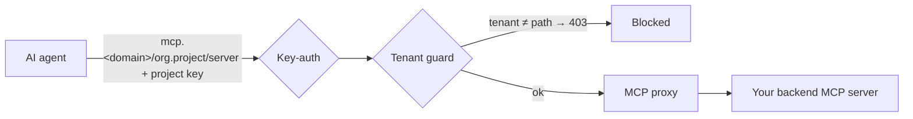

# เซิร์ฟเวอร์ MCP (MCP servers)

MCP gateway ช่วยให้คุณสามารถมอบสิทธิ์**การเข้าถึงเครื่องมือภายใต้การควบคุม**ให้แก่ AI agent ของคุณได้ โดยคุณสามารถลงทะเบียนเซิร์ฟเวอร์ Model Context Protocol (MCP) ระยะไกลแยกตามแต่ละโปรเจกต์ ซึ่งระบบ gateway จะทำหน้าที่ช่วยคัดกรองการเข้าถึงโดยอ้างอิงสิทธิ์การยืนยันตัวตน การแยกส่วนข้อมูล และระบบตรวจสอบประวัติการใช้งานแบบเดียวกันกับการรับส่งข้อมูลของ LLM

::: info ผู้ที่มีสิทธิ์ในการดำเนินการนี้
**Org admin** (สิทธิ์เฉพาะในองค์กรของตนเอง) และ **Platform admin** โดยดำเนินการผ่านหน้าจอ **Projects → MCP Servers**
:::

## ขั้นตอนการรับส่งข้อมูลการร้องขอของ MCP ภายใต้การควบคุม

คำร้องขอจะต้องมี **API key ของโปรเจกต์**ที่ถูกต้องสำหรับการยืนยันตัวตน (key-auth) และจะสามารถเข้าถึงได้เฉพาะเส้นทางที่กำหนดไว้ใน**โปรเจกต์ของตนเองเท่านั้น**สำหรับการป้องกันระดับผู้เช่า (tenant guard) โดยการใช้คีย์จากโปรเจกต์อื่นจะได้รับสถานะ `403` กลับไป

## การลงทะเบียนเซิร์ฟเวอร์

1. เปิดหน้า **Projects → MCP Servers** และคลิก **Add server**
2. กำหนด **ชื่อ (name)** ระบุ **URL ของเซิร์ฟเวอร์ MCP ต้นทาง (backend MCP server URL)** ตั้งค่า **เวลาหมดอายุ (timeout)** และข้อมูลรับรองสิทธิ์ของระบบต้นทางหากระบบต้นทางต้องการ
3. สลับสวิตช์ **enabled** เพื่อเปิดใช้งานและทำการบันทึก โดยฝั่ง control plane จะสร้างเส้นทางจัดส่งข้อมูลและกฎการแยกส่วนข้อมูลให้โดยอัตโนมัติ
4. คัดลอก **connect URL** ที่ระบบสร้างขึ้นเพื่อส่งต่อให้นักพัฒนาของคุณนำไปใช้เชื่อมต่อดังนี้
   `https://mcp.<your-domain>/<organization>.<project>/<server-name>`

## สิ่งที่อยู่ภายใต้การกำกับดูแล (สำหรับระยะที่ 1)

- **การเข้าถึง:** agent จะยืนยันตัวตนด้วย API key ของโปรเจกต์ ซึ่งสามารถใช้งานได้ตัวเดียวครอบคลุมทั้งบริการแชทและเครื่องมือต่าง ๆ
- **การแยกส่วนข้อมูล:** ระบบจะแยกสิทธิ์ใช้งานตามแต่ละโปรเจกต์อย่างเคร่งครัด โดยคีย์ของโปรเจกต์หนึ่งจะไม่สามารถเข้าถึงเซิร์ฟเวอร์ของอีกโปรเจกต์หนึ่งได้
- **กิจกรรมการใช้งาน:** ทุกกิจกรรมการเรียกใช้งานเครื่องมือ (tool call) จะถูกบันทึกไว้แยกตามรายองค์กร

::: info ขอบเขตการทำงาน
การทำงานในระยะแรกนี้จะครอบคลุมในส่วนของระบบกำกับดูแลการเข้าถึงและแคตตาล็อกของเซิร์ฟเวอร์ MCP ระยะไกล สำหรับความสามารถในการกำหนดงบประมาณหรือ guardrail แยกตามรายเครื่องมือ รวมถึงการสร้างเซิร์ฟเวอร์ MCP จาก REST API โดยอัตโนมัติ จะเป็นความสามารถที่จะเปิดให้ใช้งานในอนาคต
:::

## ขั้นตอนต่อไป

นักพัฒนาสามารถเชื่อมต่อไปยังเซิร์ฟเวอร์เหล่านี้ได้โดยศึกษาคู่มือ [การใช้งาน MCP server](/th/user/use-mcp-servers)
