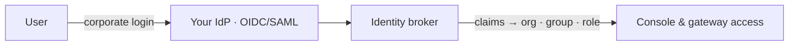

# SSO และระบบเชื่อมต่อ IdP (SSO & IdP brokering)

แต่ละองค์กรสามารถเชื่อมต่อกับผู้ให้บริการระบุตัวตน (identity provider) **ของตนเอง** ได้ โดยผู้ใช้งานจะลงชื่อเข้าใช้งานด้วยบัญชีของบริษัท และจะเข้าสู่ระบบในองค์กร กลุ่ม และบทบาทสิทธิ์การใช้งานที่ถูกต้องโดยอัตโนมัติ ทำให้ไม่ต้องเสียเวลาตั้งค่าสำหรับผู้ใช้งานเป็นรายคน

::: info ผู้ที่มีสิทธิ์ในการดำเนินการนี้
**Org admin** สามารถกำหนดค่าผู้ให้บริการระบุตัวตนขององค์กรตนเองได้ที่หน้า **Organization → SSO** ส่วน Platform admin จะสามารถกำหนดค่าวิธีการเข้าสู่ระบบในระดับโกลบอล
:::

## แนวทางการทำงานของระบบเชื่อมต่อ IdP

ระบบเชื่อมต่อ (broker) จะทำหน้าที่อ่านข้อมูลคุณลักษณะ (claims) ที่ผู้ให้บริการระบุตัวตนของคุณส่งมา เช่น อีเมล ชื่อ กลุ่ม และนำข้อมูลเหล่านั้นไปจับคู่กับ**องค์กร กลุ่ม และบทบาท**ที่ถูกต้อง เมื่อผู้ใช้งานลงชื่อเข้าใช้งานเป็นครั้งแรก ระบบจะทำการสร้างบัญชีให้แบบทันทีทันใด (just-in-time provisioning) โดยไม่ต้องสร้างบัญชีผู้ใช้ล่วงหน้าด้วยตัวเอง

## วิธีการเชื่อมต่อผู้ให้บริการระบุตัวตนของคุณ

1. เปิดหน้า **Organization → SSO**
2. เพิ่มการเชื่อมต่อแบบ **OIDC** หรือ **SAML** โดยระบุ endpoint หรือข้อมูลเมทาดาตาที่ดึงมาจาก IdP ของคุณ
3. กำหนดค่า **การจับคู่คุณลักษณะ (claim mappings)** เพื่อระบุว่าข้อมูลชุดใดที่ระบุอีเมล ชื่อ และกลุ่มผู้ใช้งาน
4. จับคู่ **กลุ่มผู้ใช้กับบทบาทสิทธิ์ (groups to roles)** เช่น จับคู่กลุ่ม `ai-admins` ของคุณไปยังบทบาท `org_admin` เป็นต้น
5. คุณสามารถเลือกจำกัดการเข้าใช้งานเฉพาะ **โดเมนอีเมล (email domains)** ที่ได้รับการตรวจสอบความถูกต้องแล้วได้ตามต้องการ
6. คลิกบันทึกและทำการทดสอบ ซึ่งหลังจากนี้ผู้ใช้งานของคุณจะสามารถลงชื่อเข้าใช้งานระบบด้วยบัญชีของบริษัทได้ทันที

::: tip ใช้กลไกเดียวสำหรับการเข้าสู่ระบบทั้งหมด
ทุกกระบวนการลงชื่อเข้าใช้งานผ่านระบบเชื่อมต่อจะทำงานผ่านเส้นทางประจำองค์กรนี้ ช่วยให้คุณสามารถจัดการข้อมูลตัวตนทั้งหมดได้จากศูนย์กลางเพียงจุดเดียว และผู้ใช้งานจะได้รับประสบการณ์ลงชื่อเข้าใช้งานขององค์กรที่สม่ำเสมอ
:::

## ขั้นตอนต่อไป

- [องค์กรและสมาชิก](/th/admin/organizations-and-members) เพื่อศึกษาเพิ่มเติมเกี่ยวกับบทบาทและกลุ่มที่จะนำมาใช้จับคู่ข้อมูล
- [การเสริมสร้างความปลอดภัย (Hardening)](/th/security/hardening) เพื่อศึกษาความปลอดภัยของข้อมูลตัวตนและ token
