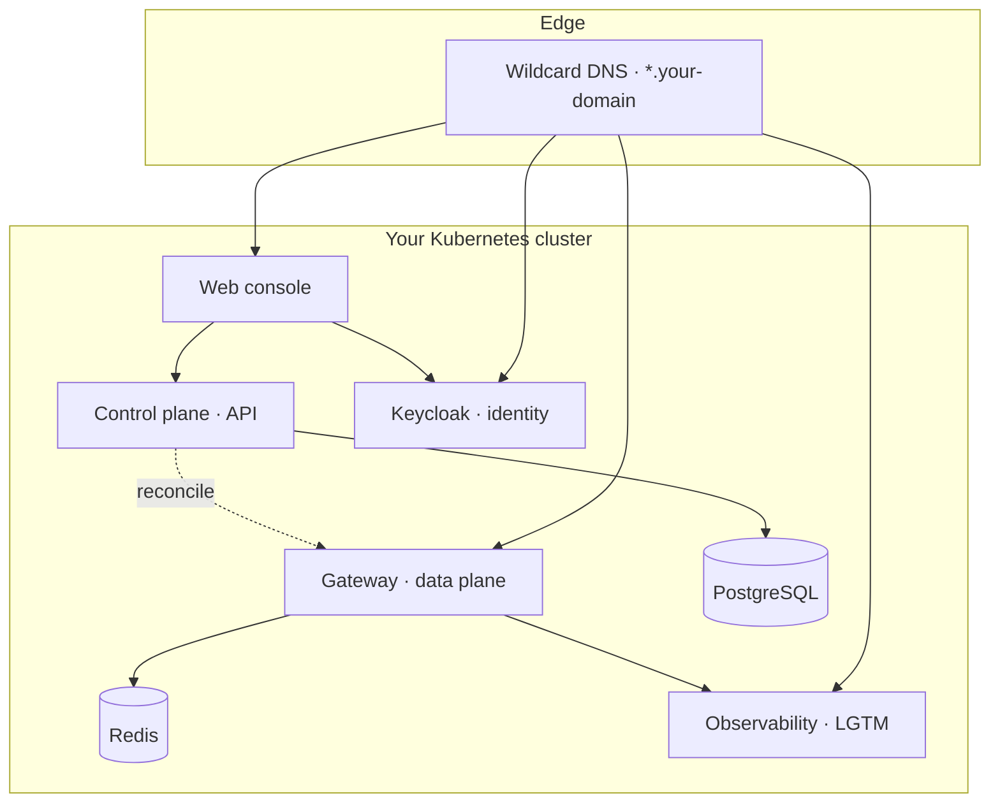

# การติดตั้ง

แพลตฟอร์มทั้งหมดสามารถติดตั้งได้ง่ายผ่าน **Helm chart เพียงตัวเดียว** และใช้**ไฟล์ values เพียงไฟล์เดียว** โดยคุณเพียงแค่กำหนดโดเมนหลัก เลือกโหมด TLS ปรับแต่งสวิตช์การทำงานระดับสูงเล็กน้อย แล้วเริ่มกระบวนการติดตั้งได้ทันที ซึ่งตัว chart จะทำการเริ่มระบบการทำงานของ gateway, control plane, ฐานข้อมูล, ระบบยืนยันตัวตน, ระบบตรวจสอบสถานะการทำงาน และ console ขึ้นมาพร้อมกันทั้งหมด

::: info สิ่งที่ต้องเตรียมความพร้อม
โปรดตรวจสอบให้แน่ใจว่าคลัสเตอร์ของคุณเป็นไปตาม [ข้อกำหนดของระบบ](/th/operate/requirements) เรียบร้อยแล้ว ได้แก่ Kubernetes ตั้งแต่เวอร์ชัน 1.28 ขึ้นไป, มีการกำหนด default StorageClass, มีโดเมนหลัก และมีระบบออกใบรับรอง wildcard TLS
:::

## โครงสร้างการติดตั้งระบบ (Deployment topology)



## 1. เพิ่ม Chart repository

ตัว Helm chart จะถูกเผยแพร่ในรูปแบบ OCI artifact หาก registry ของคุณจำเป็นต้องยืนยันสิทธิ์ ให้ลงชื่อเข้าใช้งานก่อน จากนั้นคุณจะสามารถติดตั้งได้โดยตรงจากลิงก์อ้างอิง OCI

```bash
helm registry login ghcr.io   # หาก registry ต้องการการยืนยันสิทธิ์
```

## 2. เขียนไฟล์ Values ของคุณ

สร้างไฟล์ `values.yaml` เพื่อระบุการกำหนดค่าต่าง ๆ สำหรับสภาพแวดล้อมนี้ โดยข้อมูลขั้นต่ำที่จำเป็นต้องระบุ ได้แก่ โดเมนของคุณ โหมด TLS ระบบยืนยันตัวตน และอีเมลผู้ดูแลระบบเริ่มต้น ดังนี้

```yaml
global:
  baseDomain: ai-gateway.example.com
  subdomainSeparator: "."        # "." สำหรับชื่อสองระดับ, "-" สำหรับระดับเดียวภายใต้ parent wildcard
  highAvailability: false        # true สำหรับระบบ HA ที่ใช้หลาย replica ในสภาพแวดล้อมจริง

tls:
  mode: letsencrypt              # letsencrypt | provided | selfsigned
  letsencrypt:
    email: platform@example.com
    dns01:
      provider: cloudflare
      dnsZone: example.com

sso:
  mode: google                   # google | mock (mock ใช้สำหรับพัฒนา/ทดสอบเท่านั้น)
  emailDomain: example.com

controlPlane:
  enabled: true
  bootstrapAdmin:
    enabled: true
    email: admin@example.com     # บุคคลแรกที่สามารถลงชื่อเข้าใช้งานและตั้งค่าระบบอื่น ๆ ได้
postgres:
  enabled: true                  # control plane จำเป็นต้องใช้งานฐานข้อมูลนี้
```

ข้อมูลที่เป็นความลับ เช่น คีย์ผู้ให้บริการ, OIDC client secret และรหัสผ่านฐานข้อมูล จะต้องจัดเก็บแยกในไฟล์ values อีกไฟล์หนึ่งที่ถูกระบุในไฟล์ `.gitignore` หรือจัดเก็บใน Kubernetes Secrets ที่มีอยู่แล้วในระบบ และต้องไม่มีการบันทึกข้อมูลเหล่านี้ลงในไฟล์หลักที่คุณทำการคอมมิตอย่างเด็ดขาด ดูรายละเอียดเพิ่มเติมได้ที่คู่มือ [การกำหนดค่า](/th/operate/configuration#secrets) และ [การเสริมสร้างความปลอดภัย](/th/security/hardening)

::: warning ห้ามบันทึกความลับลงใน Git
กำหนดค่า `secrets.createFromValues: true` และระบุไฟล์เก็บความลับภายในเครื่อง หรือกำหนดค่าเป็น `false` และระบุอ้างอิงไปยัง Secrets เดิมที่มีอยู่แล้วซึ่งจัดการโดย Vault หรือ sealed-secrets โดยตรง และห้ามระบุข้อมูลสิทธิ์การใช้งานเหล่านี้ลงในไฟล์ `values.yaml` หลักเป็นอันขาด
:::

## 3. ติดตั้งระบบ

```bash
helm install opsta-ai-gateway oci://ghcr.io/opsta/charts/opsta-ai-gateway \
  --namespace opsta-ai-gateway --create-namespace \
  -f values.yaml -f secrets-values.yaml
```

ตัว chart จะทำการติดตั้ง operator ที่จำเป็น ได้แก่ cert-manager, CloudNativePG และ Redis operator ให้โดยอัตโนมัติ เว้นแต่ว่าคุณจะกำหนดค่าให้ [ใช้ระบบเดิมที่มีอยู่แล้วบนคลัสเตอร์](/th/operate/byo-operators)

## 4. รอให้ระบบพร้อมทำงาน

control plane จะทำการย้ายฐานข้อมูล (database migrations) และดำเนินการปรับประสานสถานะครั้งแรกก่อนที่จะเปลี่ยนสถานะเป็นพร้อมทำงาน (ready) ซึ่งช่วยรับประกันได้ว่า gateway จะไม่มีวันทำงานในสถานะที่กำหนดค่าไม่เสร็จสิ้นอย่างแน่นอน

```bash
kubectl -n opsta-ai-gateway rollout status deploy/control-plane
kubectl -n opsta-ai-gateway get pods
```

```bash
$ kubectl -n opsta-ai-gateway get pods
NAME                                    READY   STATUS    RESTARTS   AGE
console-7c9b8c476f-9q4md                1/1     Running   0          12m
console-oauth2-proxy-6b746965fd-2xk8p   1/1     Running   0          12m
control-plane-5d5bf75cc8-hg82g          1/1     Running   0          12m
gateway-higress-7d8c9b6f54-p7w2n        1/1     Running   0          14m
keycloak-0                              1/1     Running   0          13m
opsta-pg-1                              1/1     Running   0          13m
redis-0                                 1/1     Running   0          13m
```

## 5. ตั้งค่า DNS และลงชื่อเข้าใช้งาน

สร้างระเบียน DNS แบบ wildcard สำหรับ `*.your-domain` ชี้มายัง ingress ของ gateway หรือปรับแต่งค่า Cloudflare Tunnel จากนั้นเปิด URL `https://console.your-domain` และลงชื่อเข้าใช้งานเป็นผู้ดูแลระบบเริ่มต้น

## ขั้นตอนต่อไป

- [การกำหนดค่า](/th/operate/configuration) — รายละเอียดโครงสร้างการกำหนดค่าทั้งหมดแยกตามหัวข้อการใช้งาน
- [TLS และโดเมน](/th/operate/tls-and-domains) — ข้อมูลรายละเอียดของใบรับรองและโดเมนย่อย
- [ระบบความพร้อมใช้งานสูง (High availability)](/th/operate/high-availability) — การเปิดใช้งานโหมดรองรับหลาย replica สำหรับใช้งานจริง
