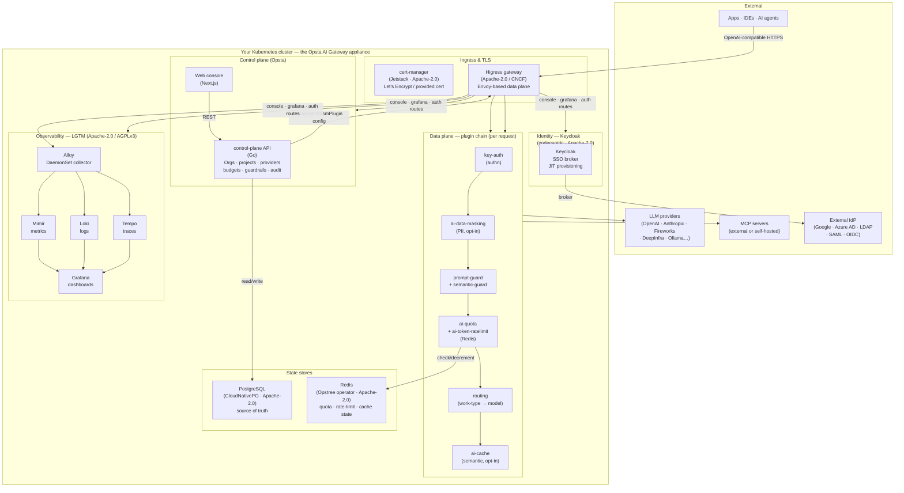
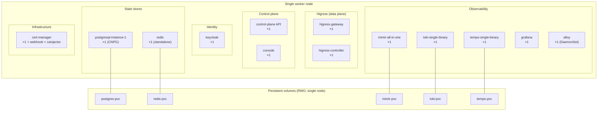
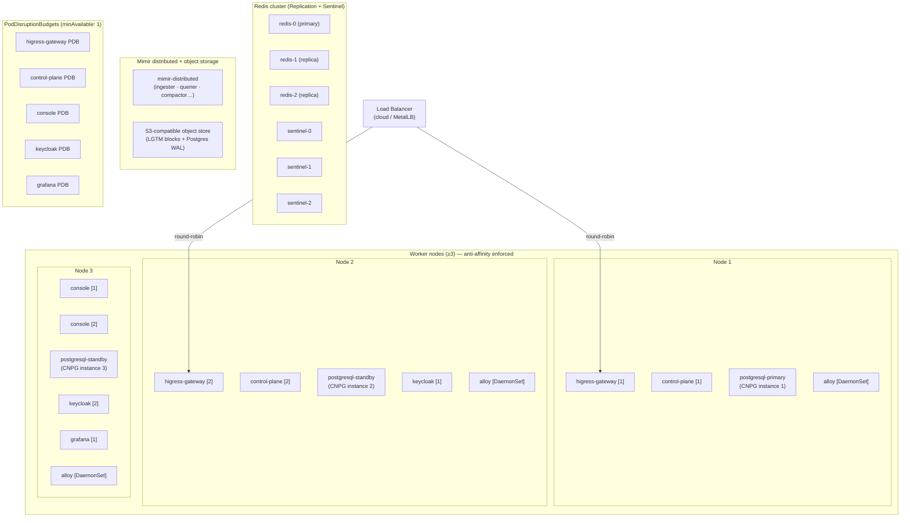
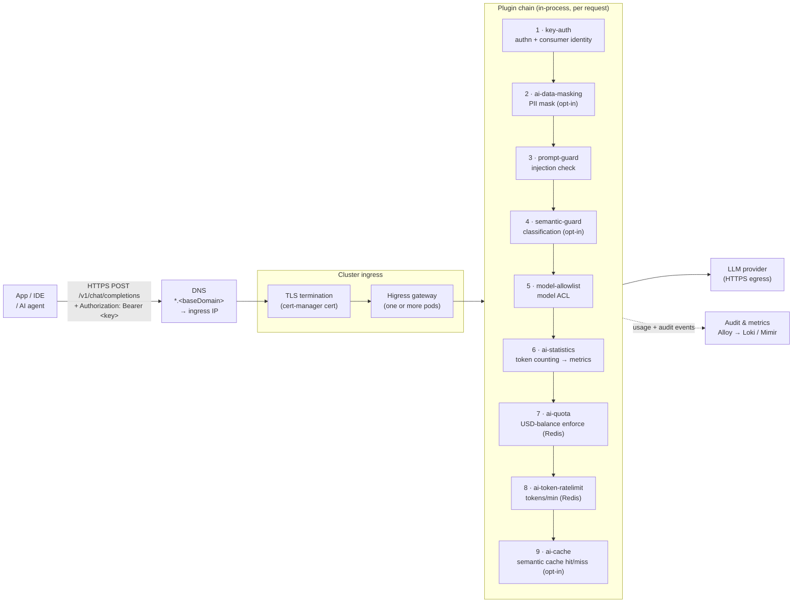
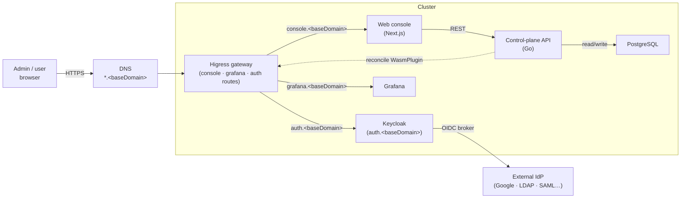
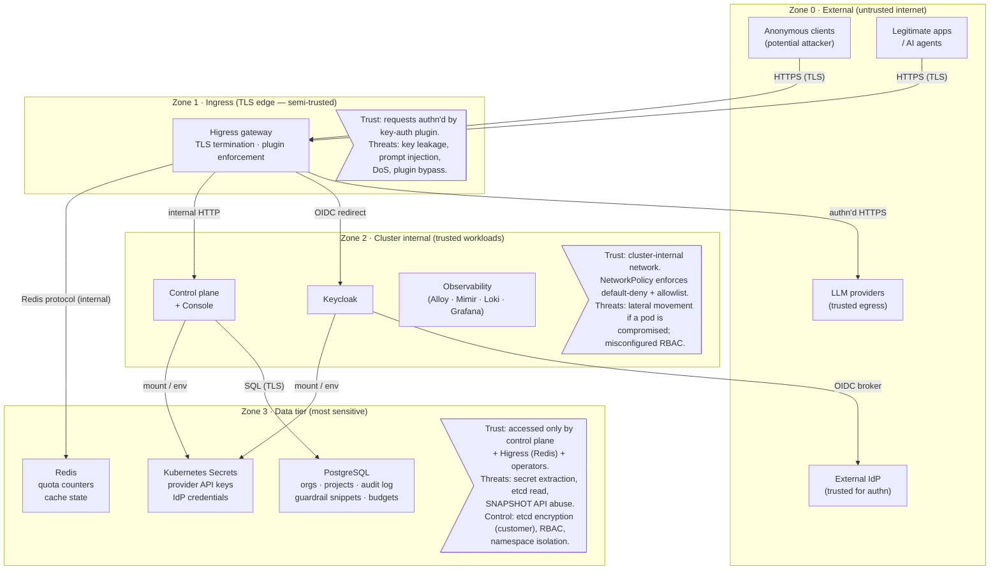

# สถาปัตยกรรมอ้างอิง

เอกสารนี้เป็นชุดคู่มืออ้างอิงสำหรับการติดตั้ง, ดูแลความปลอดภัย, ควบคุมการทำงาน และอนุมัติการใช้งาน **Opsta AI Gateway** ในองค์กรของคุณ โดยจะครอบคลุมสถาปัตยกรรม 2 รูปแบบ ได้แก่ **Standalone** (โครงสร้างนำร่องหรือโหนดเดี่ยว) และ **High Availability** (โครงสร้างพร้อมใช้งานสูงสำหรับการใช้งานจริง) พร้อมทั้งแถลงความสามารถที่ผลิตภัณฑ์รองรับและไม่รองรับในปัจจุบันอย่างตรงไปตรงมา เพื่อช่วยให้คณะกรรมการตรวจสอบสถาปัตยกรรมของคุณพิจารณาจากข้อมูลข้อเท็จจริงจริงของระบบ

โปรดอ่านเอกสารนี้ควบคู่ไปกับตาราง [ความรับผิดชอบร่วมกันและระดับความพร้อมของระบบ](./shared-responsibility.md) และ [รายการตรวจสอบความพร้อมสำหรับใช้งานจริง](./production-readiness.md) ซึ่งข้อจำกัดหรือช่องว่างต่าง ๆ ที่ระบุไว้ในหน้านี้จะมีรายละเอียดรองรับอยู่ในเอกสารทั้งสองฉบับดังกล่าว

---

## การเลือกรูปแบบสถาปัตยกรรม (Topology)

| คุณสมบัติ | โหมด Standalone | โหมด High Availability |
|---|---|---|
| **รูปแบบการใช้งาน** | โครงการนำร่อง (PoC), พัฒนาระบบ, ประเมินการใช้งานภายใน | สภาพแวดล้อมใช้งานจริง, รองรับผู้ใช้งานภายนอก |
| **โครงสร้างการจัดโหนด** | 1 worker node รันทุกบริการ | 3 worker nodes ขึ้นไป และ 3 control-plane nodes สำหรับ RKE2 |
| **จำนวน Replica** | 1 replica ต่อส่วนประกอบ | 2 ถึง 3 replicas ต่อส่วนประกอบแบบ stateless และใช้ฐานข้อมูลแบบคลัสเตอร์ |
| **ฐานข้อมูล** | 1 PostgreSQL instance | คลัสเตอร์ CNPG ขนาด 3 instances พร้อมระบบ sync และ failover อัตโนมัติ |
| **ที่จัดเก็บข้อมูลแคชและโควตา** | Redis แบบ standalone | Redis Replication ร่วมกับ Sentinel (3 โหนด) |
| **ข้อมูลชี้วัด (Metrics)** | Mimir ทำงานแบบรวมในตัว (local PVC) | Mimir ทำงานแบบกระจายศูนย์ร่วมกับที่จัดเก็บแบบวัตถุ |
| **ล็อกและประวัติการทำงาน** | Loki และ Tempo ทำงานแบบไฟล์เดี่ยว (local PVC) | Loki และ Tempo ทำงานแบบขยายระบบร่วมกับที่จัดเก็บแบบวัตถุ |
| **การสำรองข้อมูล** | ทางเลือกเพิ่มเติม (ปิดการใช้งานตามค่าเริ่มต้น) | จำเป็นต้องใช้งาน — สำรองข้อมูลไปยัง object store และมีแผนทดสอบกู้คืน |
| **เป้าหมายระยะเวลากู้คืนระบบ (RTO)** | หลักชั่วโมง (ติดตั้งใหม่ด้วยตนเอง) | หลักนาทีถึงชั่วโมง (ติดตั้งใหม่ด้วย IaC และกู้คืนข้อมูล) |
| **เป้าหมายระยะเวลาข้อมูลสูญหาย (RPO)** | อ้างอิงตามไฟล์สำรองข้อมูลล่าสุด (หลักชั่วโมง) | อ้างอิงรอบการสำรองข้อมูลล่าสุด โดยเป้าหมายน้อยกว่า 1 ชั่วโมง |
| **ข้อจำกัดของระบบที่ระบุไว้** | ไม่มีความพร้อมใช้งานสูง, เสี่ยงสูญเสียข้อมูลเมื่อโหนดหยุดทำงาน, กู้คืนระบบผ่านการ backup เท่านั้น | ทำงานแบบไซต์เดี่ยว, ไม่รองรับการ failover ข้ามภูมิภาค, กู้คืนระบบผ่านการ backup |
| **คีย์ควบคุมใน Helm** | `global.highAvailability: false` | `global.highAvailability: true` |

::: warning แถลงการณ์พื้นฐานด้านการกู้คืนระบบจากภัยพิบัติอย่างตรงไปตรงมา
สถาปัตยกรรมทั้งสองรูปแบบทำงานในรูปแบบ**ไซต์เดี่ยวและกู้คืนระบบผ่านการสำรองข้อมูลเท่านั้น** สถาปัตยกรรมแบบ HA สามารถทนต่อความเสียหายระดับสูญเสียโหนดเดี่ยวภายในคลัสเตอร์ได้ด้วยจำนวน replica และกฎ anti-affinity แต่ไม่สามารถทนต่อความเสียหายระดับสูญเสียไซต์ทั้งหมดได้หากไม่มีการกู้คืนข้อมูลจากไฟล์สำรองไปยังโครงสร้างพื้นฐานใหม่ ดูรายละเอียดเพิ่มเติมได้ที่คู่มือ [การสำรองข้อมูลและการกู้คืนระบบจากภัยพิบัติ](./backup-and-dr.md) และส่วน [ความน่าเชื่อถือระบบ HA และแผนการกู้คืนระบบ](#ความน่าเชื่อถือระบบ-ha-และแผนการกู้คืนระบบ) ด้านล่าง
:::

---

## สถาปัตยกรรมเชิงตรรกะ (Logical architecture)

ส่วนประกอบทั้งหมดจะถูกส่งมอบรวมกันเป็นชุดระบบเดียวที่ผ่านการทดสอบมาแล้วเป็นอย่างดี โดยคุณทำหน้าที่จัดเตรียมคลัสเตอร์ Kubernetes ที่เข้าเกณฑ์กำหนด ที่จัดเก็บข้อมูล และระบบ DNS รวมถึงผู้ให้บริการระบุตัวตนภายนอก (IdP) และที่จัดเก็บข้อมูลแบบวัตถุ (object store) ที่เข้ากันได้กับ S3 เพิ่มเติมในส่วนที่จำเป็น

**ตารางรายละเอียดไลเซนส์ของแต่ละส่วนประกอบ ดังนี้**

| ส่วนประกอบ | ไลเซนส์ | ผู้ให้บริการพัฒนา |
|---|---|---|
| Higress gateway + controller | Apache-2.0 | CNCF / Alibaba |
| Control plane + Console | สงวนลิขสิทธิ์ (Opsta) | Opsta |
| PostgreSQL via CloudNativePG | Apache-2.0 | CNCF |
| Redis via Opstree operator | Apache-2.0 | Opstree |
| Keycloak | Apache-2.0 | Red Hat / CNCF |
| cert-manager | Apache-2.0 | CNCF |
| Grafana | AGPLv3 | Grafana Labs |
| Mimir, Loki, Tempo, Alloy | Apache-2.0 | Grafana Labs |
| Qdrant (เลือกเปิดใช้เพิ่มเติม) | Apache-2.0 | Qdrant |
| Ollama (เลือกเปิดใช้เพิ่มเติม) | MIT | Ollama |

---

## สถาปัตยกรรม Standalone (PoC หรือระบบโหนดเดี่ยว)

### โครงสร้างการติดตั้งระบบ

ทุกส่วนงานประมวลผลจะทำงานอยู่บนโหนด worker Kubernetes เพียงโหนดเดียวเท่านั้น โดยโครงสร้างนี้จะไม่มีระบบสำรอง หากโหนดหยุดทำงานจะส่งผลให้ระบบทั้งหมดหยุดให้บริการทันที โปรดใช้สำหรับการประเมินผลระบบหรือการใช้งานเครื่องมือเป็นการภายในเท่านั้น

### ข้อจำกัดของระบบในโหมด Standalone

- **ไม่มีความพร้อมใช้งานสูง:** ทุกส่วนประกอบจะทำงานผ่าน pod เพียงตัวเดียว หาก pod เสียหายหรือโหนดรีบูตจะส่งผลให้ระบบหยุดให้บริการทันที
- **เสี่ยงสูญเสียข้อมูลเมื่อโหนดเสียหาย:** Persistent volume จะทำงานเฉพาะภายในโหนดเครื่องนั้นตามค่าเริ่มต้น การเปลี่ยนโหนดใหม่จะมีความเสี่ยงทำให้ข้อมูลสูญหาย เว้นแต่จะมี StorageClass ที่สามารถย้ายโอนย้าย PVC ได้
- **กู้คืนระบบผ่านการ backup เท่านั้น:** การกู้คืนระบบจะใช้วิธีการติดตั้งคลัสเตอร์ใหม่ด้วย IaC ร่วมกับการกู้คืนฐานข้อมูลจากไฟล์สำรองข้อมูลล่าสุด (ถ้ามี) ทั้งนี้ระบบสำรองข้อมูลจะปิดการทำงานตามค่าเริ่มต้น คุณจำเป็นต้องตั้งค่าเปิดใช้งานก่อนเริ่มต้นใช้งานจริง
- **ไม่เหมาะสำหรับข้อมูลที่อยู่ภายใต้กฎระเบียบข้อบังคับ** เว้นแต่คุณจะยอมรับข้อจำกัดที่ระบุไว้ใน [ตารางความรับผิดชอบร่วมกัน](./shared-responsibility.md)

---

## สถาปัตยกรรม High availability (สำหรับใช้งานจริง)

### โครงสร้างการติดตั้งระบบ

ส่วนงานประมวลผลจะกระจายการทำงานข้ามโหนด worker อย่างน้อย 3 โหนดขึ้นไป สำหรับส่วนประกอบแบบ stateless จะทำงานอย่างน้อย 2 replicas ร่วมกับการบังคับใช้กฎ pod anti-affinity ส่วนส่วนประกอบจัดเก็บสถานะ (stateful) จะทำงานในรูปแบบคลัสเตอร์โดยใช้ความสามารถในตัวของ operator

### ตารางความพร้อมใช้งานสูงแยกตามส่วนประกอบ

| ส่วนประกอบ | จำนวน replica ในโหมด Standalone | จำนวน replica ในโหมด HA | การตั้งค่า PDB ในโหมด HA | ตัวควบคุม Operator หรือการทำงานแบบคลัสเตอร์ |
|---|---|---|---|---|
| Higress gateway | 1 | ≥2 + anti-affinity | minAvailable 1 | Higress controller |
| Higress controller | 1 | 1 (มีระบบเลือกผู้นำ) | — | ในตัว |
| Control-plane API | 1 | 2 + anti-affinity | minAvailable 1 | — (stateless) |
| Console (Next.js) | 1 | 2 + anti-affinity | minAvailable 1 | — (stateless) |
| PostgreSQL | 1 instance | 3 instances (standby แบบ sync) | — (จัดการโดย operator) | CloudNativePG |
| Redis | 1 standalone | 3 (Replication ร่วมกับ Sentinel) | — (จัดการโดย operator) | Opstree operator |
| Keycloak | 1 | ≥2 + anti-affinity | minAvailable 1 | codecentric chart |
| Mimir | ทำงานแบบ pod เดี่ยว | ส่วนประกอบแยกส่วนกระจายศูนย์ | แยกตามแต่ละส่วนประกอบ | Grafana |
| Loki | ทำงานแบบ pod เดี่ยว | ขยายระบบร่วมกับที่จัดเก็บแบบวัตถุ | แยกตามแต่ละส่วนประกอบ | Grafana |
| Tempo | ทำงานแบบ pod เดี่ยว | ขยายระบบร่วมกับที่จัดเก็บแบบวัตถุ | แยกตามแต่ละส่วนประกอบ | Grafana |
| Grafana | 1 | ≥2 + anti-affinity | minAvailable 1 | — |
| Alloy | DaemonSet (1 ต่อโหนด) | DaemonSet (1 ต่อโหนด) | — (DaemonSet) | — |
| cert-manager | 1 | ≥2 | minAvailable 1 | — |

---

## ระบบเครือข่ายและระบบทราฟฟิก

### เส้นทางการส่งข้อมูลคำร้องขอ (Request path)

### เส้นทางการเข้าใช้งานสำหรับผู้ดูแลระบบและเบราว์เซอร์ (Browser / admin path)

---

## ขอบเขตความน่าเชื่อถือและแบบจำลองภัยคุกคาม

แผนภาพต่อไปนี้แสดงรายละเอียดพื้นที่ความน่าเชื่อถือ (trust zones) และการไหลของข้อมูลหลักที่ผ่านขอบเขตเหล่านั้น โดยคุณสามารถดูรายละเอียดการวิเคราะห์ภัยคุกคามแบบ STRIDE, มาตรการควบคุมความปลอดภัย และความเสี่ยงตกค้างได้ที่คู่มือ [ภาพรวมด้านความปลอดภัย](/th/security/overview) และ [การเสริมสร้างความปลอดภัย](/th/security/hardening)

::: info มาตรการควบคุมขอบเขตความน่าเชื่อถือในปัจจุบัน
- **จาก Zone 0 ไปยัง Zone 1:** มีระบบ TLS ที่ระดับ Ingress (cert-manager) และปลั๊กอิน key-auth จะปฏิเสธการเชื่อมต่อที่ไม่ผ่านการยืนยันตัวตนทั้งหมด
- **จาก Zone 1 ไปยัง Zone 2:** สื่อสารผ่านโปรโตคอล HTTP ภายในคลัสเตอร์ และมี NetworkPolicy คอยจำกัดสิทธิ์ว่า pod ใดสามารถสื่อสารกับ pod ใดได้บ้าง
- **จาก Zone 2 ไปยัง Zone 3:** การเข้าถึง PostgreSQL จะถูกควบคุมด้วยข้อมูลรับรองสิทธิ์ (ผ่าน CNPG app secret) และการเข้าถึง Redis จะถูกจำกัดด้วย NetworkPolicy ในระดับเครือข่าย
- **การเข้ารหัสข้อมูลลับใน Zone 3:** ใช้ระบบ Kubernetes Secrets มาตรฐาน (เข้ารหัสเฉพาะ base64) เว้นแต่คุณจะเปิดใช้งานการเข้ารหัสฐานข้อมูล etcd, ใช้ sealed-secrets หรือใช้ตัวเชื่อมต่อข้อมูลลับภายนอกร่วมกับ KMS ดูรายละเอียดเพิ่มเติมได้ที่ข้อ G3 ใน [ตารางความรับผิดชอบร่วมกัน](./shared-responsibility.md)
:::

---

## ความน่าเชื่อถือระบบ HA และแผนการกู้คืนระบบ

รายละเอียดขนาดของทรัพยากร CPU แรม และดิสก์แยกตามส่วนประกอบจะถูกบันทึกสถิติและมีรายละเอียดอยู่ในคู่มือ [ข้อกำหนดของระบบ](./requirements.md)

การจำลองปริมาณงาน: รองรับทราฟฟิกประมาณ 5 RPS ตลอดเวลา ใช้งาน 1 องค์กรหรือโปรเจกต์ และมีผู้ใช้งานประมาณ 10 คน ซึ่งเป็นเกณฑ์พื้นฐานสำหรับ PoC หรือทีมขนาดเล็ก

**สถิติโหมด Standalone (ผลการวัดจริงในเวอร์ชัน v1.11.1):** ใช้งาน CPU ประมาณ 0.1 vCPU และแรม 3.8 GiB ในช่วง idle, ทรัพยากร PVC รวมขนาด 28 Gi
ขนาดโหนดแนะนำ: **4 ถึง 8 vCPU, แรม 8 ถึง 16 GiB และพื้นที่ดิสก์ 50 Gi**

**สถิติโหมด HA (ประเมินจากการวัดในโหมด Standalone):** ใช้งาน CPU ประมาณ 340m CPU และแรม 7 GiB กระจายข้าม 3 โหนดขึ้นไป
ขนาดโหนดแนะนำต่อ worker node: **4 ถึง 8 vCPU, แรม 8 ถึง 16 GiB และพื้นที่ดิสก์ 50 Gi**

ดูรายละเอียดจำแนกทรัพยากรรายส่วนประกอบได้ที่ [ข้อกำหนดของระบบ → ทรัพยากรระบบประมวลผล](./requirements.md#ทรัพยากรระบบประมวลผล-compute)

### ตารางวิเคราะห์ลักษณะข้อบกพร่องและผลกระทบ (FMEA) ที่ผ่านการทดสอบในคลัสเตอร์ใช้งานจริง (โหมด Standalone, เวอร์ชัน v1.11.1)

ตารางต่อไปนี้จัดเก็บข้อมูลประวัติจากการทดสอบกรณีข้อบกพร่องต่าง ๆ ในคลัสเตอร์สำหรับพัฒนาระบบ `k3d-higress-lab` (รัน k3s v1.36, ซอฟต์แวร์เวอร์ชัน v1.11.1, สถาปัตยกรรมแบบ Standalone) โดยแสดงข้อมูลสิ่งที่ทดสอบ ผลลัพธ์ที่พบ และผลกระทบต่อระบบปฏิบัติการ

| รูปแบบข้อบกพร่อง | วิธีการทดสอบ | พฤติกรรมที่สังเกตพบ | ระยะเวลากู้คืน | ผลกระทบต่อการทำงานของระบบ |
|---|---|---|---|---|
| **pod ของ control plane ถูกทำลาย** | สั่งทำลาย pod ด้วยคำสั่ง `kubectl delete pod -l app=control-plane` (บังคับ) | ฝั่ง data plane ยังคงให้บริการตอบกลับสถานะ **HTTP 200** อย่างต่อเนื่องโดยไม่มี request ใดตกหล่น | ประมาณ 28 วินาที (Deployment เริ่มสร้าง pod ใหม่ทำงานทดแทน) | การให้บริการคำร้องขอไม่ได้รับผลกระทบ การแก้ไขค่ากำหนด เช่น เพิ่มผู้ให้บริการ จัดเส้นทาง กำหนดงบประมาณ จะถูกระงับชั่วคราวจนกว่า CP จะรีสตาร์ทเสร็จสิ้น ในโหมด HA การใช้ 2 replicas ควบคู่กับ PDB จะช่วยป้องกันปัญหา pod เดี่ยวหยุดทำงานได้ |
| **pod ของ PostgreSQL ถูกทำลาย** | สั่งทำลาย pod ด้วยคำสั่ง `kubectl delete pod opsta-pg-1` (บังคับ) | ฝั่ง data plane ยังคงให้บริการตอบกลับสถานะ **HTTP 200** อย่างต่อเนื่องโดยไม่มี request ใดตกหล่น | ประมาณ 36 วินาที (CNPG operator ทำการคืนค่าและเริ่มระบบ pod) | การให้บริการคำร้องขอไม่ได้รับผลกระทบ โดย Envoy จะอ่านค่าและทำงานตามโครงสร้างปลั๊กอินล่าสุดจากแคช การเรียกใช้งาน API ของ CP ที่ต้องบันทึกค่าลงใน PG จะล้มเหลวชั่วคราว ในโหมด HA คลัสเตอร์แบบ 3 instances จะสั่งสลับโหนด primary ขึ้นมาทำงานทดแทนโดยอัตโนมัติ |
| **pod ของ Keycloak ถูกทำลาย** | สั่งทำลาย pod ด้วยคำสั่ง `kubectl delete pod keycloak-keycloakx-0` (บังคับ) | การเรียกใช้งานด้วย AI API key ส่งกลับสถานะ **HTTP 200** ตามปกติ ส่วนการเชื่อมต่อเพื่อสร้างเซสชัน SSO ใหม่บนเบราว์เซอร์จะถูกบล็อก | ประมาณ 37 วินาที (StatefulSet ดำเนินการเริ่มระบบ pod ใหม่) | ปลั๊กอิน `key-auth` จะทำหน้าที่ตรวจสอบความถูกต้องของคีย์ตามค่ากำหนดเดิมที่แคชไว้ในฝั่ง data plane โดยไม่มีการเชื่อมต่อไปยัง Keycloak จริง การเข้าสู่ระบบใน console และเซสชัน OAuth ใหม่จะใช้งานไม่ได้จนกว่า KC จะรีสตาร์ทเสร็จสิ้น ในโหมด HA จะใช้ 2 replicas ควบคู่กับ PDB |
| **pod ของ Redis ถูกลบ (จำลองโหนดรีสตาร์ท)** | สั่งทำลาย pod ด้วยคำสั่ง `kubectl delete pod redis-0` (บังคับ) | ในระหว่างกระบวนการเริ่มระบบใหม่: เกตเวย์ส่งสถานะ **HTTP 403** `ai-quota.noquota` กลับไป และปฏิเสธทุกการเชื่อมต่อ (fail-closed) | ประมาณ 16 วินาที (StatefulSet ดำเนินการเริ่มระบบ pod ใหม่) | ปลั๊กอิน Wasm ของ `ai-quota` จะไม่สามารถเชื่อมต่อกับ Redis ได้ จึงเก็บบันทึกล็อกระดับวิกฤตและปฏิเสธคำร้องขอที่ถูกควบคุมด้วยโควตาทั้งหมด พฤติกรรมของระบบที่ออกแบบไว้คือการปฏิเสธคำร้องขอทั้งหมดในกรณีที่ระบบเชื่อมต่อขัดข้อง เพื่อป้องกันไม่ให้เกิดค่าใช้จ่ายงบประมาณเกินเพดานที่กำหนดในขณะที่ไม่สามารถระบุสถานะงบประมาณที่แท้จริงได้ ในโหมด HA การใช้งาน Redis Replication ร่วมกับ Sentinel จะช่วยดูแลให้มีโหนด primary พร้อมทำงานเสมอแม้มีการสูญเสียโหนดเดี่ยวในระบบ |

**ส่วนงานที่ยังไม่ผ่านการทดสอบบนคลัสเตอร์ห้องปฏิบัติการนี้:**
- การสูญเสียโหนดในสถาปัตยกรรมแบบ HA (เนื่องจากการทดสอบ FMEA ข้างต้นทำบนสถาปัตยกรรม Standalone โหนดเดี่ยว)
- การหยุดทำงานของ cert-manager (ใบรับรอง TLS เดิมจะยังคงให้บริการได้ตามปกติ แต่จะไม่สามารถดำเนินการต่ออายุใบรับรองใหม่ได้จนกว่า cert-manager จะกลับมาทำงาน)
- ระยะเวลากู้คืนและสลับโหนด primary ของ Redis (ผ่านกระบวนการ Sentinel election) ในโหมด HA

::: warning ระบบ Redis อยู่ในส่วนวิกฤตของการควบคุมงบประมาณโควตา
ในโหมด Standalone การรีสตาร์ท pod ของ Redis จะส่งผลให้ระบบปฏิเสธคำร้องขอที่เกี่ยวข้องกับงบประมาณทั้งหมดชั่วคราวเป็นเวลาประมาณ 16 วินาทีจนกว่า Redis จะกลับมาพร้อมทำงาน โปรดเฝ้าระวังสถานะผ่าน `kube_pod_status_phase{pod=~"redis.*"}` และตั้งค่าแจ้งเตือนเมื่อมีการรีสตาร์ท pod ในโหมด HA การสลับโหนดผ่าน Sentinel จะช่วยขจัดปัญหาช่องว่างในการทำงานนี้ออกไปได้
:::

**เป้าหมายการกู้คืนระบบจากภัยพิบัติ (เกณฑ์พื้นฐานที่ตรงไปตรงมา):**

| ตัวชี้วัด | โหมด Standalone | โหมด HA |
|---|---|---|
| **RTO** | หลักชั่วโมง (ดำเนินการด้วยตนเองเพื่อสร้าง IaC ใหม่และกู้คืนข้อมูล DB) | หลักนาทีถึงชั่วโมง (สร้างระบบด้วย IaC และกู้คืนข้อมูล โดยตั้งเป้าหมายน้อยกว่า 2 ชั่วโมง) |
| **RPO** | ยึดตามอายุของไฟล์สำรองข้อมูลล่าสุด (ปิดการสำรองข้อมูลตามค่าเริ่มต้น) | ยึดตามรอบความถี่ของการสำรองข้อมูล (ต้องตั้งค่าใช้งาน โดยเป้าหมายน้อยกว่า 1 ชั่วโมง) |
| **DR model** | ไซต์เดี่ยว และต้องกู้คืนข้อมูลจากไฟล์สำรอง | ไซต์เดี่ยว และต้องกู้คืนข้อมูลจากไฟล์สำรอง |
| **สูญเสียโหนดเดี่ยว** | ระบบทั้งหมดหยุดให้บริการชั่วคราว | ระบบสามารถทำงานต่อได้ด้วยโครงสร้าง replicas และกฎ anti-affinity |
| **สูญเสียทั้งไซต์** | กู้คืนระบบผ่านการสำรองข้อมูล | กู้คืนระบบผ่านการสำรองข้อมูลไปยังโครงสร้างพื้นฐานใหม่ |

ดูรายละเอียดขั้นตอนการกู้คืนข้อมูลได้ที่คู่มือ [การสำรองข้อมูลและการกู้คืนระบบจากภัยพิบัติ](./backup-and-dr.md)

---

## ด้านความปลอดภัย (Security)

คุณสามารถศึกษาเอกสารด้านความปลอดภัยฉบับเต็มได้ที่ส่วนหัวข้อ [ความปลอดภัย](/security/overview) โดยมีหัวข้อหลักดังนี้

- [ภาพรวมด้านความปลอดภัย](/security/overview) — สรุปโครงสร้างแบบจำลองภัยคุกคามและมาตรการควบคุมความปลอดภัย
- [การเสริมสร้างความปลอดภัย (Hardening)](/security/hardening) — การตั้งค่า PSS securityContext, NetworkPolicy และการจัดระดับตามมาตรฐาน CIS-K8s
- [ความเป็นเอกราชของข้อมูล](/security/data-sovereignty) — รายละเอียดการส่งข้อมูลไปยังผู้ให้บริการและนโยบายไม่นำข้อมูลไปใช้เทรนโมเดล
- [รูปแบบสิทธิ์การเข้าใช้งาน (RBAC)](/security/rbac) — รายละเอียดการแมปสิทธิ์องค์กร/โปรเจกต์/ผู้ใช้ไปยังเกตเวย์
- [การตรวจสอบประวัติและการปฏิบัติตามข้อกำหนด](/security/audit-and-compliance) — ข้อมูลประวัติการใช้งาน ระยะเวลาจัดเก็บ และการแมปข้อกำหนดการปฏิบัติตามกฎหมาย

---

## นโยบายการจัดการข้อมูล (Data handling)

เอกสารนโยบายการจัดการข้อมูลฉบับเต็ม ครอบคลุมการจำแนกประเภทข้อมูล ระยะเวลาการจัดเก็บ นโยบายการปิดบังข้อมูลที่ละเอียดอ่อนของ guardrail แนวทางการใช้งาน PII masking และการรับส่งข้อมูลไปยังผู้ให้บริการต้นทาง สามารถศึกษาเพิ่มเติมได้ที่คู่มือ [นโยบายการจัดการข้อมูล](./data-handling.md)

**ตารางอ้างอิงข้อมูลและแหล่งจัดเก็บ ดังนี้**

| แหล่งจัดเก็บ | ข้อมูลที่จัดเก็บ | ระดับความสำคัญ | การตั้งค่าระยะเวลาจัดเก็บ |
|---|---|---|---|
| PostgreSQL | ข้อมูลองค์กร, โปรเจกต์, ผู้ใช้งาน, เมทาดาตาของคีย์, งบประมาณ, นโยบาย guardrail, **ประวัติการใช้งาน (audit log)** และ **เนื้อหาข้อความคำสั่งที่ถูกบล็อกโดย guardrail** | สูง | จัดการผ่านโครงสร้างฐานข้อมูล และสามารถตั้งค่าการปิดบังข้อมูลข้อความคำสั่งได้ |
| Kubernetes Secrets | API key ของผู้ให้บริการ, ข้อมูลรับรองสิทธิ์ของ IdP, ใบรับรอง TLS และคีย์เซสชันต่าง ๆ | วิกฤตสูงสุด | ต้องเปิดใช้งานการเข้ารหัสข้อมูลที่ระดับ etcd ของคลัสเตอร์ (จัดเตรียมโดยผู้ใช้งาน) |
| Redis | ตัวนับโควตางบประมาณ, สถานะจำกัดอัตราการใช้งาน และข้อมูลระบบแคชตามความหมาย (semantic cache) | ต่ำ (ข้อมูลมีระยะเวลาจำกัดและสร้างใหม่ได้) | จัดการข้อมูลผ่านเกณฑ์ TTL และข้อมูลจะหายไปเมื่อเริ่มระบบคลัสเตอร์ใหม่ |
| Object store (โหมด HA) | บล็อกข้อมูลชี้วัดของ Mimir, บล็อกข้อมูลล็อกของ Loki, ข้อมูลประวัติ traces ของ Tempo และข้อมูล WAL ของ PostgreSQL | ปานกลาง | ตั้งค่าระยะเวลาจัดเก็บแยกรายส่วนประกอบ |

คำสั่ง (prompts) และคำตอบ (completions) จะถูกส่งผ่าน gateway ไปยังผู้ให้บริการ LLM ที่คุณกำหนดค่าไว้ **โดยไม่มีการส่งข้อมูลลักษณะ phone home กลับมายัง Opsta แต่อย่างใด** และสิทธิ์ในการนำข้อมูลของคุณไปใช้ฝึกฝนโมเดลหรือไม่ จะขึ้นอยู่กับข้อตกลงและสัญญาที่คุณจัดทำร่วมกับผู้ให้บริการรายนั้น ๆ โดยตรง ดูรายละเอียดเพิ่มเติมได้ที่ [ความเป็นเอกราชของข้อมูล](/security/data-sovereignty)

---

## ระบบตรวจสอบสถานะการทำงานและเป้าหมายระดับการให้บริการ (SLOs)

รายละเอียดคำจำกัดความของเป้าหมายระดับการให้บริการ (SLO), นโยบายงบประมาณข้อผิดพลาด (error budget), สัญญาณการทำงานหลัก และกฎการแจ้งเตือนบน Grafana มีอธิบายแยกรายละเอียดไว้ที่คู่มือ [ระบบตรวจสอบสถานะการทำงานของแพลตฟอร์ม](./observability-platform.md)

ชุดซอฟต์แวร์ LGTM ที่ติดตั้งมาในตัวจะได้รับการเชื่อมโยงระบบไว้ล่วงหน้า ดังนี้

- **Metrics:** Alloy จะเก็บข้อมูลจากทุกส่วนประกอบ และ Mimir ทำหน้าที่จัดเก็บแยกข้อมูลผู้เช่ารายองค์กร
- **Logs:** Alloy จะรวบรวมไฟล์บันทึกการทำงานคอนเทนเนอร์ และ Loki ทำหน้าที่จัดเก็บแยกตามผู้เช่ารายองค์กร
- **Traces:** Higress จะทำหน้าที่ส่ง OTLP traces และ Tempo ทำหน้าที่จัดเก็บข้อมูล
- **Dashboards:** Grafana มาพร้อมกับแดชบอร์ดเกตเวย์ แดชบอร์ดตรวจสอบโควตางบประมาณ และแดชบอร์ดปริมาณใช้งานรายองค์กรสำเร็จรูป
- **Alerting:** ระบบแจ้งเตือนบน Grafana ได้รับการตั้งค่าเริ่มต้นไว้แล้ว คุณเพียงเชื่อมโยงต่อไปยังระบบรับการแจ้งเตือนของคุณ เช่น PagerDuty, Opsgenie หรือ Webhook ดูรายละเอียดเพิ่มเติมได้ที่ [ตารางความรับผิดชอบร่วมกัน](./shared-responsibility.md)

---

## ระบบยืนยันตัวตนและการเข้าถึง

ดูรายละเอียดเพิ่มเติมได้ที่คู่มือ [SSO และ IdP](/admin/sso-and-idp) และ [รูปแบบสิทธิ์การเข้าใช้งาน (RBAC)](/security/rbac)

**สรุปแนวทางปฏิบัติ:**

- **ระบบเชื่อมต่อตัวตน:** Keycloak จะทำหน้าที่เป็นตัวกลางควบคุมการเข้าสู่ระบบทั้งหมด ไม่ว่าจะเป็นบัญชีภายในระบบ, Google Workspace, Azure AD/LDAP, OIDC หรือ SAML โดยสิทธิ์ผู้ดูแลระบบแพลตฟอร์มจะมอบสิทธิ์โดยอ้างอิงตามอีเมลที่กำหนดไว้ในค่า `console.adminEmails`
- **JIT provisioning:** บัญชีผู้ใช้งานจะถูกสร้างขึ้นในระบบโดยอัตโนมัติเมื่อลงชื่อเข้าใช้งานเป็นครั้งแรกผ่านระบบเชื่อมต่อ (Just-In-Time) ทั้งนี้ระบบยังไม่รองรับการยกเลิกสิทธิ์บัญชีผู้ใช้อัตโนมัติเมื่อมีพนักงานลาออก คุณจำเป็นต้องเข้าไปลบสิทธิ์ใช้งานด้วยตนเองใน Keycloak (สำหรับสถาปัตยกรรม SCIM อยู่ในแผนงานการพัฒนาในอนาคต)
- **ระบบเข้าใช้งานยามฉุกเฉิน (Break-glass):** บัญชีผู้ใช้งานภายในชื่อ `kcadmin` (รหัสผ่านจัดเก็บในคีย์ `secrets-values.yaml` ในระบบจัดเก็บความลับของคุณ) จะทำหน้าที่เข้าใช้งานคอนโซลเพื่อจัดการระบบได้ในกรณีที่ผู้ให้บริการ IdP หลักไม่สามารถเข้าใช้งานได้
- **API keys:** ออกคีย์แยกรายผู้ใช้และรายโปรเจกต์ผ่านหน้าจอ console โดยจะจัดเก็บในรูปแบบรหัสแฮช HMAC ใน PostgreSQL (ตัวคีย์จริงจะไม่ได้รับการบันทึกเก็บไว้ในฐานข้อมูล) การเปลี่ยนคีย์ใหม่จะใช้วิธียกเลิกคีย์เก่าและออกคีย์ใหม่ทดแทน
- **การหมุนเวียนใบรับรองความปลอดภัยและข้อมูลลับ:** ดูรายละเอียดขั้นตอนได้ที่คู่มือ [TLS และโดเมน](./tls-and-domains.md)

---

## เวอร์ชันของแพลตฟอร์มและส่วนประกอบต่าง ๆ (Platform & version matrix)

ชุดส่วนประกอบที่ระบุในคอมโพเนนต์เมทริกซ์ด้านล่างนี้ คือรายการเวอร์ชันที่ผ่านการทดสอบการทำงานร่วมกันกับซอฟต์แวร์เวอร์ชันปัจจุบันอย่างสมบูรณ์ การปรับเปลี่ยนเวอร์ชันของส่วนประกอบใดก็ตามจะจำเป็นต้องทำการทดสอบการทำงานร่วมกันของทั้งระบบใหม่อีกครั้ง ดูรายละเอียดได้ที่ไฟล์ `version.yaml` และกฎข้อที่ 9 ในไฟล์ CLAUDE.md

**เวอร์ชันผลิตภัณฑ์ปัจจุบัน:** อ้างอิงตามคีย์ `version.yaml:product.version` (ปัจจุบันคือ **v1.11.1**)

| ส่วนประกอบ | Helm chart / operator ที่ใช้งาน | เวอร์ชันปัจจุบัน | ไลเซนส์ |
|---|---|---|---|
| Kubernetes | — | ตั้งแต่เวอร์ชัน 1.28 ขึ้นไป | — |
| Higress | `higress.io/higress` | 2.2.2 | Apache-2.0 |
| cert-manager | `jetstack/cert-manager` | v1.20.2 | Apache-2.0 |
| CloudNativePG | `cnpg/cloudnative-pg` | 0.28.2 | Apache-2.0 |
| Opstree Redis operator | `ot-helm/redis-operator` | 0.24.0 | Apache-2.0 |
| Keycloak | `codecentric/keycloakx` | อ้างอิงตามไฟล์ `version.yaml` | Apache-2.0 |
| Mimir (โหมด Standalone) | `oci://ghcr.io/opsta/mimir-standalone` | 0.1.0 | Apache-2.0 |
| Mimir (โหมด distributed, HA) | `grafana/mimir-distributed` | 6.0.6 | Apache-2.0 |
| Loki | `grafana-community/loki` | 17.4.1 | Apache-2.0 |
| Tempo | `grafana-community/tempo` | 2.2.3 | Apache-2.0 |
| Grafana | `grafana-community/grafana` | 12.4.5 | AGPLv3 |
| Alloy | `grafana/alloy` | 1.8.2 | Apache-2.0 |

**แพลตฟอร์มที่ผ่านการทดสอบ:** k3s (สำหรับขั้นตอนพัฒนา/CI), RKE2 (ระบบอ้างอิงหลัก), Kubernetes ทั่วไป, EKS, GKE และ AKS
**สถาปัตยกรรมระบบที่รองรับ:** amd64 (ส่วนระบบ arm64 อยู่ในระหว่างขั้นตอนทดสอบความถูกต้อง)

---

## ขั้นตอนการติดตั้งและการควบคุมดูแลระบบ

ศึกษาคู่มือ [การติดตั้ง](./install.md) สำหรับรายละเอียดขั้นตอนการติดตั้งด้วยคำสั่ง `helmfile sync` ตามลำดับขั้นตอน

::: info คู่มือการติดตั้งระบบอยู่ระหว่างขั้นตอนจัดทำ
คู่มือการติดตั้งระบบแบบ HA สำหรับ RKE2 บน Linux VM ซึ่งเป็นระบบอ้างอิงอ้างอิงหลัก อยู่ในระหว่างการจัดทำคู่ขนานตามแผนพัฒนา โดยคู่มือนี้จะจัดเก็บไว้ที่ไฟล์ `/operate/deploy/ha-rke2.md` ซึ่งจะครอบคลุมเนื้อหาการจัดเตรียมทรัพยากร การกำหนดค่า การติดตั้ง การตรวจสอบความถูกต้อง การกำหนดค่าเริ่มต้นในวันแรก และการอนุมัติความปลอดภัยสำหรับสภาพแวดล้อมใช้งานจริง
:::

**ขั้นตอนการอัปเกรดระบบและการย้อนกลับเวอร์ชัน:** ดูรายละเอียดที่คู่มือ [การอัปเกรดระบบ](./upgrades.md) ทั้งนี้การย้ายโครงสร้างข้อมูลของ control plane จะเป็นการเปลี่ยนไปข้างหน้าเท่านั้นในขณะระบบกำลังทำงาน โปรดสำรองข้อมูลฐานข้อมูลล่วงหน้าก่อนทำการอัปเกรดทุกครั้ง และตรวจสอบสิทธิ์ความสามารถในการกู้คืนข้อมูลก่อนดำเนินการตามข้อ G7 ใน [ตารางความรับผิดชอบร่วมกัน](./shared-responsibility.md)

**การติดตั้งในระบบปิด (Air-gap):** ดูรายละเอียดขั้นตอนการตั้งค่า registry-mirror และการส่งข้อมูล Helm chart ผ่าน OCI ได้ที่คู่มือ [การติดตั้งในระบบปิด (Air-gapped install)](./air-gap.md)

---

## ความรับผิดชอบร่วมกันและระดับความพร้อมของระบบ

คุณสามารถตรวจสอบรายละเอียดตารางความรับผิดชอบการดูแลระบบและเกณฑ์ระดับความพร้อมของบริการได้ที่หน้า [ความรับผิดชอบร่วมกันและระดับความพร้อมของระบบ](./shared-responsibility.md) หน้านี้จะเป็นฐานข้อมูลจริงสำหรับการตรวจสอบยืนยัน ซึ่งเนื้อหาในทุกหัวข้อด้านบนจะไม่มีการอ้างอิงสิทธิ์การควบคุมใด ๆ นอกเหนือไปจากที่ระบุว่าอยู่ในสถานะ **Shipped** ในตารางหน้านี้

---

## รายการตรวจสอบความพร้อมสำหรับใช้งานจริง

ก่อนเริ่มเปิดระบบงานให้พร้อมใช้งานจริง โปรดดำเนินการตรวจสอบรายการรายละเอียดทั้งหมดตามแนวทางปฏิบัติในคู่มือ [รายการตรวจสอบความพร้อมสำหรับใช้งานจริง](./production-readiness.md) โดยรายการดังกล่าวจะเป็นเอกสารสำคัญที่ทีมงานของคุณจะต้องตรวจสอบและลงนามรับรองร่วมกันก่อนเริ่มปล่อยทราฟฟิกจริงผ่านเกตเวย์
