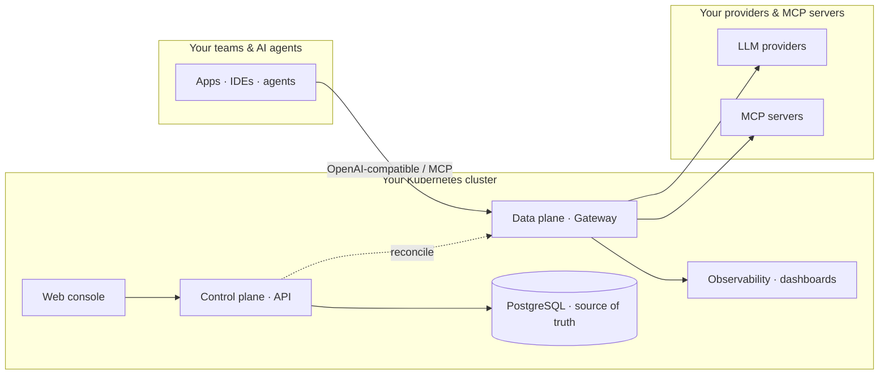

# สถาปัตยกรรมระบบ

Opsta AI Gateway แยก**ระบบควบคุมการจัดการ**ออกจาก**ระบบประมวลผลข้อมูลการร้องขอ** โดยระบบควบคุมที่คุณเป็นเจ้าของจะคอยดูแลระบบกำหนดค่าและส่งต่อไปยังระบบประมวลผลข้อมูล ซึ่งทั้งสองระบบนี้ทำงานอยู่ภายในคลัสเตอร์ Kubernetes ของคุณ

## ระบบควบคุมและระบบประมวลผลข้อมูล

**ระบบควบคุม (Control plane):** บริการส่วนการจัดการที่ทำงานร่วมกับฐานข้อมูล PostgreSQL ซึ่งเป็นแหล่งข้อมูลความจริงหนึ่งเดียว (single source of truth) สำหรับข้อมูลทุกอย่าง ไม่ว่าจะเป็นองค์กร โปรเจกต์ ผู้ให้บริการ เส้นทาง งบประมาณ guardrail คีย์ และเซิร์ฟเวอร์ MCP ผู้ดูแลระบบจะปรับแต่งค่ากำหนดต่าง ๆ ผ่าน [web console](/th/admin/console-tour) หรือใช้ API ของระบบ โดยระบบควบคุมจะตรวจสอบความถูกต้องของค่ากำหนดนั้น ๆ แล้วบันทึกลงในฐานข้อมูล

**ระบบประมวลผลข้อมูล (Data plane):** ตัว gateway ที่ทำหน้าที่คอยประมวลผลการรับส่งข้อมูลการร้องขอจริง โดยจะตรวจสอบความถูกต้องของ request บังคับใช้งานงบประมาณและขีดจำกัดต่าง ๆ เรียกใช้งานระบบป้องกัน (guardrail) จัดเส้นทางไปยังผู้ให้บริการที่เหมาะสม ส่งคืนข้อมูลจากแคช และบันทึกข้อมูลการใช้งานรวมถึงประวัติการทำงาน (audit) ระบบประมวลผลข้อมูลจะไม่จัดเก็บข้อมูลการกำหนดค่าใด ๆ ไว้ที่ตัวมันเอง

## การปรับประสานสถานะเพื่อป้องกันความคลาดเคลื่อนของข้อมูล

ระบบควบคุมจะทำการปรับประสานสถานะ (reconcile) จากสถานะที่บันทึกไว้ใน PostgreSQL ไปยังระบบประมวลผลข้อมูลอย่างต่อเนื่อง เมื่อผู้ดูแลระบบเพิ่มผู้ให้บริการหรือเปลี่ยนแปลงงบประมาณ กระบวนการปรับประสานสถานะจะนำการเปลี่ยนแปลงนั้นไปใช้กับ gateway โดยอัตโนมัติ ส่งผลให้การทำงานของระบบมีความสม่ำเสมอและตรวจสอบได้เสมอ โดยผู้ดูแลระบบไม่จำเป็นต้องเข้าไปแก้ไขไฟล์ YAML ด้วยตัวเอง และไม่มีปัญหาเรื่องการกำหนดค่าคลาดเคลื่อน (configuration drift) ให้ต้องกังวลใจ โดยสามารถดูข้อมูลเพิ่มเติมได้ที่ [แนวทางการทำงาน](/th/admin/console-tour) และ [กระบวนการปรับประสานสถานะในวงจรชีวิตของการร้องขอ](/th/overview/request-lifecycle)

## ส่วนประกอบอื่น ๆ ของระบบ

- **Web console:** พอร์ทัลที่รักษาความปลอดภัยด้วยระบบ SSO และมีหน้าจอสำหรับผู้ดูแลระบบ โดยดูข้อมูลเพิ่มเติมได้ที่คู่มือ [การใช้งาน](/th/user/get-access) และ [การบริหารจัดการ](/th/admin/console-tour)
- **ระบบยืนยันตัวตน (Identity):** ระบบ Single Sign-On (SSO) และระบบเชื่อมต่อกับผู้ให้บริการระบุตัวตนแบบแยกรายองค์กร (IdP brokering) โดยดูข้อมูลเพิ่มเติมได้ที่ [SSO และ IdP](/th/admin/sso-and-idp)
- **ระบบตรวจสอบสถานะการทำงาน (Observability):** ชุดซอฟต์แวร์สำหรับเก็บข้อมูลชี้วัด (metrics) ล็อก (logs) และประวัติการร้องขอ (traces) ที่ติดตั้งภายในระบบตัวเอง โดยรองรับการแยกข้อมูลเป็นรายองค์กรอย่างชัดเจน ดูข้อมูลเพิ่มเติมได้ที่ [ระบบตรวจสอบสถานะการทำงาน](/th/admin/observability)
- **ระบบจัดเก็บสถานะ (State stores):** PostgreSQL สำหรับเก็บค่ากำหนด การใช้งาน และประวัติงาน ส่วน Redis ใช้สำหรับเก็บสถานะจำกัดปริมาณการร้องขอ (rate-limit) และโควตา

ทุกส่วนประกอบทำงานอยู่ภายในสภาพแวดล้อมของคุณทั้งหมด จึงไม่มีข้อมูล prompt หรือข้อมูลใด ๆ ของคุณหลุดออกนอกคลัสเตอร์อย่างเด็ดขาด โดยสามารถศึกษาเส้นทางการเดินทางของการร้องขอหนึ่งรายการผ่านส่วนประกอบเหล่านี้ได้ที่ [วงจรชีวิตของการร้องขอ](/th/overview/request-lifecycle)
