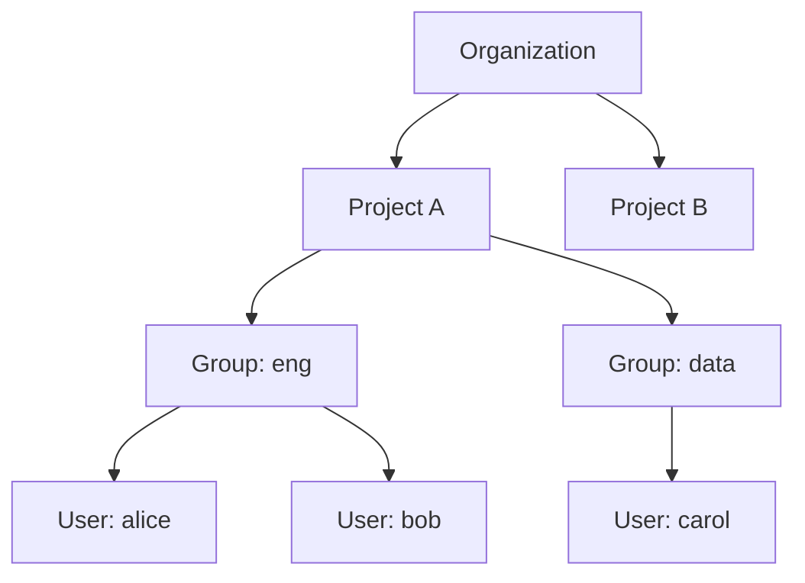
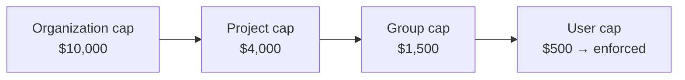

# ระบบหลายผู้เช่า (Multi-tenancy)

Opsta AI Gateway ถูกออกแบบมาให้รองรับสถาปัตยกรรมแบบหลายผู้เช่า (multi-tenant) ตั้งแต่เริ่มต้น โดยระบบเดียวสามารถให้บริการแก่หลากหลายองค์กรได้อย่างแยกส่วนเป็นเอกเทศอย่างสมบูรณ์ และภายใต้แต่ละองค์กรจะมีระบบจัดลำดับขั้นการควบคุมค่ากำหนด งบประมาณ และการสิทธิ์เข้าถึงอย่างชัดเจน

## โครงสร้างลำดับชั้นของระบบผู้เช่า

- **องค์กร (Organization):** ขอบเขตของการแยกข้อมูล การเรียกเก็บเงิน และระบบ Single Sign-On (SSO) สำหรับลูกค้าระดับองค์กรรายหนึ่ง โดยแต่ละองค์กรจะสามารถเชื่อมต่อกับผู้ให้บริการระบุตัวตนของตนเองได้ และไม่สามารถมองเห็นข้อมูล ค่ากำหนด หรือข้อมูลการวัดระยะไกล (telemetry) ขององค์กรอื่นได้
- **โปรเจกต์ (Project):** เป็นส่วนจัดการโครงสร้างการจัดเส้นทาง (routing) ผู้ให้บริการ guardrail งบประมาณ และ API key โดยแต่ละองค์กรสามารถสร้างได้หลายโปรเจกต์ เช่น สร้างแยกเป็นรายผลิตภัณฑ์หรือรายสภาพแวดล้อมการทำงาน
- **กลุ่ม (Group):** ทีมการทำงานภายในโปรเจกต์ ซึ่งมักจะถูกแมปมาจากกลุ่มของผู้ให้บริการระบุตัวตน ใช้สำหรับรวมสิทธิ์การเข้าถึงและงบประมาณ
- **ผู้ใช้งาน (User):** สมาชิกที่ลงชื่อเข้าใช้งานระบบและเรียกใช้งาน gateway

ทุก ๆ API key งบประมาณ ขีดจำกัด บันทึกประวัติการใช้งาน และข้อมูลชี้วัด จะถูกอ้างอิงด้วยข้อมูล tuple `organization.project.user` แบบครบถ้วน ส่งผลให้การระบุผู้รับผิดชอบและการแยกส่วนข้อมูลมีความถูกต้องแม่นยำสูง และไม่มีการใช้งานคีย์ร่วมกันแบบแบน

## บทบาทและสิทธิ์การเข้าถึง (RBAC)

| บทบาท | สิ่งที่สามารถทำได้ |
|---|---|
| **Platform admin** | จัดการได้ทุกองค์กร กำหนดราคาโมเดลในระดับโกลบอล อ่านบันทึกประวัติการใช้งานข้ามองค์กร และกำหนดค่าวิธีการเข้าสู่ระบบของแพลตฟอร์ม |
| **Org admin** | จัดการดูแลองค์กรเดียว ได้แก่ สมาชิก โปรเจกต์ ผู้ให้บริการ การจัดเส้นทาง งบประมาณ guardrail เซิร์ฟเวอร์ MCP และผู้ให้บริการระบุตัวตนขององค์กรนั้น ๆ |
| **Member** | เรียกใช้งาน gateway ได้แก่ ออกคีย์และจัดการ API key ของตนเอง ดูปริมาณการใช้งานและงบประมาณ และตรวจสอบรายการร้องขอของตนที่ถูกบล็อก |

ผู้ใช้งานเป็นบัญชีตัวตนในระดับโกลบอล โดยการเป็นสมาชิกขององค์กรจะได้รับบทบาทสิทธิ์ที่กำหนดไว้ และผู้ใช้งานหนึ่งรายสามารถเป็นสมาชิกของหลายองค์กรได้ ดูข้อมูลเพิ่มเติมได้ที่ [องค์กรและสมาชิก](/th/admin/organizations-and-members)

## งบประมาณแบบลำดับขั้น

งบประมาณจะส่งผลไล่ลงมาตามลำดับชั้น และระบบจะยึดเพดานงบประมาณที่เข้มงวดที่สุดเสมอ ซึ่งผู้ใช้งานจะไม่มีวันใช้งานเกินขีดจำกัดที่กลุ่ม โปรเจกต์ หรือองค์กรกำหนดไว้ แม้ว่าขีดจำกัดเฉพาะของผู้ใช้รายนั้นจะตั้งไว้สูงกว่าก็ตาม

การทำงานลักษณะนี้ช่วยให้ผู้ดูแลแพลตฟอร์มสามารถกำหนดเพดานค่าใช้จ่ายสูงสุดเอาไว้ในระดับบนสุด พร้อมทั้งมอบอำนาจให้ผู้ดูแลระดับล่างกำหนดขีดจำกัดย่อยลงไปได้ ดูข้อมูลเพิ่มเติมได้ที่ [งบประมาณและขีดจำกัด](/th/admin/budgets-and-limits)

## การแยกส่วนข้อมูลในระบบตรวจสอบสถานะการทำงาน

แต่ละองค์กรจะได้รับแดชบอร์ดและระบบเก็บข้อมูลชี้วัดที่แยกส่วนกันอย่างชัดเจน ทำให้อัตราการใช้งานและข้อมูลวัดระยะไกลของลูกค้าแต่ละรายไม่มีทางรั่วไหลหรือมองเห็นโดยรายอื่น ดูข้อมูลเพิ่มเติมได้ที่ [ระบบตรวจสอบสถานะการทำงาน](/th/admin/observability)
