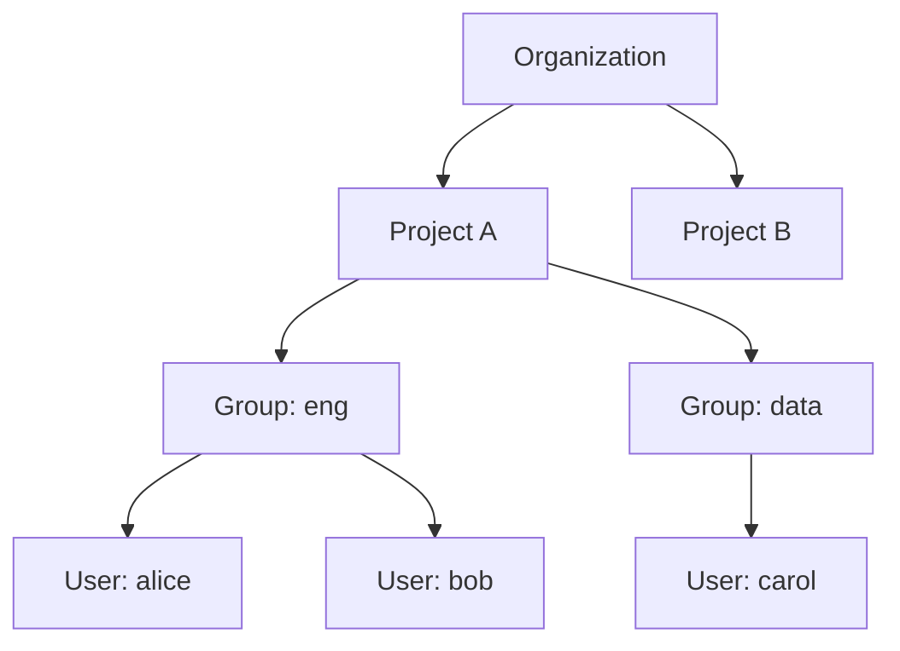
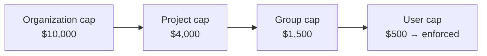

> 🌐 **เอกสารภาษาไทยกำลังจัดทำ** — เนื้อหาด้านล่างเป็นภาษาอังกฤษชั่วคราว จนกว่าจะมีการแปล. _This page is not yet translated; English content is shown temporarily._

# Multi-tenancy model

Opsta AI Gateway is multi-tenant by design. One platform serves many organizations, each fully isolated, and
within each organization a clear hierarchy controls configuration, budgets, and access.

## The hierarchy

- **Organization** — the isolation, billing, and SSO boundary. One enterprise customer. Each organization
  connects its own identity provider and cannot see another's data, config, or telemetry.
- **Project** — owns a routing configuration, providers, guardrails, budgets, and API keys. An organization has
  many projects (for example, one per product or environment).
- **Group** — a team within a project, usually mapped from an identity-provider group. Used for access rollups
  and budget aggregation.
- **User** — a member who signs in and/or calls the gateway.

Every API key, budget, limit, usage record, and metric is keyed by the full tuple
`organization.project.user` — so attribution and isolation are exact, never a flat shared key.

## Roles and access (RBAC)

| Role | Can do |
|---|---|
| **Platform admin** | Manage every organization; set global model pricing; read the cross-organization audit log; configure platform login methods. |
| **Org admin** | Manage one organization — members, projects, providers, routing, budgets, guardrails, MCP servers, and the organization's identity provider. |
| **Member** | Use the gateway: issue and manage their own API keys, view their usage and budget, and review their blocked requests. |

Members are global identities; membership in an organization carries a role, and a user can belong to more than
one organization. See [Organizations & members](/th/admin/organizations-and-members).

## Hierarchical budgets

Budgets cascade down the hierarchy, and the **tightest cap always wins** — a user can never spend more than
their group, project, or organization allows, even if their own cap is higher.

This lets platform owners set a hard ceiling at the top while delegating finer limits downward. See
[Budgets & limits](/th/admin/budgets-and-limits).

## Isolation in observability

Each organization gets its own isolated dashboards and metrics tenancy — one customer's usage and telemetry are
never visible to another. See [Observability](/th/admin/observability).
