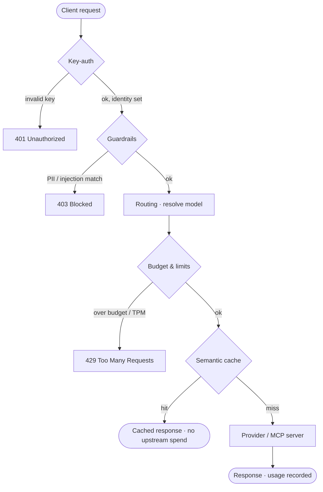

# วงจรชีวิตของการร้องขอ

ทุกคำร้องขอ (request) จะต้องทำงานผ่านลำดับของนโยบายความปลอดภัย (policy gate) ในระบบประมวลผลข้อมูล (data plane) ตามลำดับที่กำหนดไว้ก่อนจะส่งไปถึงผู้ให้บริการต้นทาง โดยแต่ละ gate สามารถเลือกที่จะอนุญาตให้คำร้องขอผ่านไปหรือปฏิเสธคำร้องขอนั้น ๆ ซึ่งการจัดลำดับการทำงานที่แน่นอนช่วยให้มั่นใจได้ว่า ตัวอย่างเช่น คำร้องขอจะได้รับการยืนยันตัวตนก่อนที่จะนำไปคิดงบประมาณ และหากพบข้อมูลในแคช ระบบจะส่งคำตอบกลับได้ทันทีโดยไม่ต้องส่งไปหาผู้ให้บริการต้นทาง ช่วยหลีกเลี่ยงการเสียค่าใช้จ่ายโดยไม่จำเป็น

## ขั้นตอนการทำงานของแต่ละ Gate ตามลำดับ

1. **การยืนยันตัวตนด้วยคีย์ (Key-auth):** ตรวจสอบความถูกต้องของ API key และดึงข้อมูลตัวตนของผู้เรียกใช้งาน (ตัวบ่งชี้ผู้ใช้ในรูปแบบ `organization.project.user`) ซึ่งกระบวนการทั้งหมดหลังจากนี้จะทำงานโดยอ้างอิงข้อมูลตัวตนนี้เป็นหลัก
2. **ระบบป้องกัน (Guardrail):** ทำหน้าที่คัดกรองข้อมูลการร้องขอ ได้แก่ การปิดบังข้อมูลส่วนบุคคล (PII masking) การตรวจจับคำสั่งที่ไม่ปลอดภัย (prompt injection) แบบอิงตามรูปแบบ และการตรวจจับ prompt injection แบบอิงตามความหมาย หากพบข้อมูลที่เข้าเงื่อนไข ระบบจะหยุดทำงานทันทีและส่งกลับสถานะ 403 ก่อนที่จะมีการเรียกใช้โมเดลใด ๆ
3. **การจัดเส้นทาง (Routing):** ทำการจับคู่โมเดลเชิงตรรกะที่ฝั่งไคลเอนต์เรียกใช้งาน เช่น `coding-default` ไปยังผู้ให้บริการที่ตั้งค่าไว้และโมเดลต้นทาง สำหรับข้อมูลการใช้งานของ agent ในขั้นตอนนี้จะทำการจัดเส้นทางไปยังเซิร์ฟเวอร์ MCP ที่ลงทะเบียนไว้
4. **งบประมาณและขีดจำกัด (Budget & limits):** ตรวจสอบงบประมาณรายเดือนแบบ USD ของผู้บริโภคซึ่งทำงานแบบลำดับขั้น และการจำกัดจำนวน token ต่อนาที หากเกินกว่าเพดานที่กำหนดไว้ ระบบจะปฏิเสธการร้องขอทันทีก่อนจะส่งข้อมูลไปถึงผู้ให้บริการ
5. **ระบบแคชตามความหมาย (Semantic cache):** หากเปิดใช้งานไว้ หากมี prompt ที่คล้ายคลึงกันเคยส่งมาขอก่อนหน้านี้ ระบบจะส่งคำตอบที่บันทึกไว้กลับไปทันที โดยข้ามขั้นตอนการเรียกใช้งานผู้ให้บริการ ช่วยประหยัดค่าใช้จ่าย token ทั้งหมด
6. **ผู้ให้บริการหรือเซิร์ฟเวอร์ MCP (Provider / MCP server):** คำร้องขอจะถูกส่งไปถึงโมเดลหรือบริการต้นทางของคุณ เมื่อได้รับคำตอบกลับมา ระบบจะบันทึกปริมาณการใช้งานเพื่อนำไปคำนวณงบประมาณ แสดงบนแดชบอร์ด และบันทึกลงประวัติการใช้งาน (audit trail)

## Gate ใดที่ปฏิเสธการร้องขอของฉัน

คุณสามารถตรวจสอบจาก HTTP status code เพื่อระบุว่า Gate ใดที่เป็นตัวหยุดการร้องขอ

| HTTP Status | Gate | ความหมาย | สิ่งที่ต้องทำ |
|---|---|---|---|
| **401 Unauthorized** | Key-auth | ไม่มี API key หรือคีย์ไม่ถูกต้อง | ตรวจสอบคีย์และ header ในรูปแบบ `Authorization: Bearer …` โดยดูข้อมูลเพิ่มเติมได้ที่ [การจัดการ API key](/th/user/api-keys) |
| **403 Blocked** | Guardrails | คำร้องขอตรงกับกฎการตรวจจับข้อมูล PII หรือ prompt injection | ตรวจสอบรายละเอียดได้ที่ [การร้องขอที่ถูกบล็อก](/th/user/blocked-requests) หรือสามารถรายงานความผิดพลาดของการตรวจจับหากจำเป็น |
| **429 Too Many Requests** | Budget & limits | ใช้งานเกินงบประมาณรายเดือนหรือจำกัดจำนวน token ต่อนาที | ตรวจสอบข้อมูลได้ที่ [ปริมาณการใช้งานและงบประมาณ](/th/user/usage-and-budget) ซึ่งผู้ดูแลระบบสามารถปรับเปลี่ยน [งบประมาณและขีดจำกัด](/th/admin/budgets-and-limits) ได้ |
| **5xx** | Provider | ผู้ให้บริการต้นทางหรือเซิร์ฟเวอร์ MCP ทำงานผิดพลาด | ตรวจสอบสถานะการทำงานของผู้ให้บริการได้ที่หน้าจอ [ผู้ให้บริการ (Providers)](/th/admin/providers) |

ดูข้อมูลเพิ่มเติมเกี่ยวกับบทบาทของตัวตนและโครงสร้างผู้เช่าต่อการตรวจสอบเหล่านี้ได้ที่ [ระบบหลายผู้เช่า (Multi-tenancy)](/th/overview/multi-tenancy)
